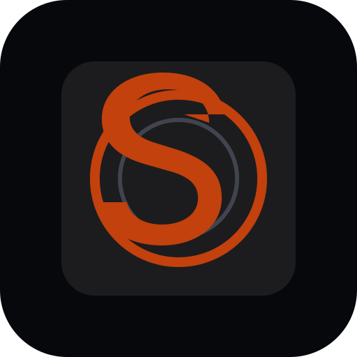

<div align="center">



# Sandbox Audio

**Your music, your podcasts, your audiobooks — on hardware you own.**

[](./LICENSE)
[](#why-this-exists)
[](#why-this-exists)

[](./BUILDING.md)
[](./BUILDING.md)
[](./BUILDING.md)

</div>

---

**Sandbox Audio** is a self-hosted player for **music, podcasts, audiobooks and ebooks**, built on a
local locker rather than someone else's catalog. It runs as **web/PWA**, **Tauri desktop** (Windows
+ Linux) and **Android** (phone and TV), and it works with the network off.

Play your own files offline, stream from a home **Sandbox Server** on your LAN, subscribe to
podcasts, read or listen to your own books, and browse catalog metadata — with no account, no
subscription, and nothing reporting home.

> **Beta software.** Expect rough edges in playback, mobile layout, and search. Not recommended as a daily driver without backups of your locker data.

## Why this exists

Streaming taught a generation that a library is something you rent. When the subscription lapses,
the shelf empties; when a licence expires, the record disappears from a collection someone thought
was theirs. The same pattern now reaches podcasts and audiobooks — media that used to be a file you
kept.

Sandbox Audio is built on the opposite assumption. The locker is on your device. The server, if you
run one, is on your LAN and belongs to your household. Removing the vendor from the picture is
supposed to leave you with a working player, not a dead one:

- **No account.** There is no sign-up, no identity, and no server of ours to sign in to.
- **No telemetry.** No analytics, no crash reporting, no phone-home. Nothing is collected because
  nothing is sent.
- **No lock-in.** Your library is files on disk. The format is not ours and leaving costs nothing.
- **Offline is the default, not a mode.** Playback resolves from the local locker first.
- **GPL-3.0.** The thing you depend on cannot be closed against you later.

## Part of Sandbox

Sandbox Audio is one of three applications sharing a household server and a common principle —
that the software you rely on should run on hardware you control.

| Project | What it is | Status |
|---------|-----------|--------|
| **Sandbox OS** | A Debian-based operating system built around *stations* — media, documents, marketplace — instead of a desktop of loose applications. | In development |
| **Sandbox Audio** | This repository. The media station: music, podcasts, audiobooks, ebooks. | Beta, builds on device |
| **Sandbox Wrestling** | A wrestling booking simulator in Godot 4.5, with its own simulation engine. | In development |

The **Sandbox Server** (`tier34`) is the shared household backend: locker sync, search proxy, and
playback-state mirroring between your own devices over your own network. Today it ships inside this
repository and is documented in [TIER34.md](./TIER34.md); extraction into a standalone package is
planned but **not started** — the trigger is a second station depending on it, and only Audio does
today.

## Before you run it

**You supply your own credentials.** No third-party API keys ship with this project. Optional
integrations — TIDAL playlist import is the current example — read their credentials from your
build environment (`VITE_TIDAL_CLIENT_ID`, `VITE_TIDAL_CLIENT_SECRET`); see `.env.example`. Leave
them unset and that feature is simply absent. Register your own application with the provider
rather than reusing anyone else's: values compiled into a client are readable by anyone holding the
build, so a shared key is a key that gets rate-limited or banned for everybody.

**You are responsible for what you point it at.** This is a player and a locker. It does not supply
music, and what is lawful to fetch, store or play depends on the source, the content and where you
live — not on this software. Acquisition resolvers (on-device extraction and similar) ship
**switched off**; enabling them is a deliberate choice, and the consequences of that choice are
yours. Set `VITE_ACQUISITION_DEFAULT_ON=true` only for a personal build where you have already
decided.

**Licensed under GPL-3.0.** See [LICENSE](./LICENSE).

**Build targets (audit-verified):** Web/PWA, Tauri desktop (Windows + Linux), Android (Capacitor). These builds are configured and run on device — they are **not published releases**. There is no tagged release, no GitHub release artifact, and no F-Droid or Play Store listing; `fastlane/` holds listing text only. Build it yourself per [BUILDING.md](./BUILDING.md). iOS and macOS desktop are not build targets at all.

Catalog discovery uses an **iTunes metadata proxy plus your local locker** — not a Spotify-scale streaming catalog.

## What the app does

- **Local locker** — IndexedDB vault for imported audio; Android mirrors blobs to durable `filesDir` for native playback ([adr/002-native-filesdir-not-cache.md](./adr/002-native-filesdir-not-cache.md)).
- **Catalog browse** — iTunes and related metadata via UI server (port 3002); full-track playback beyond previews requires Sandbox Server tier resolve.
- **Sandbox Server (tier34)** — Self-hosted Node API on port **3001** for acquire, locker sync, search proxy, Feed, Connect, DLNA, and debrid resolve when configured.
- **Playback** — Hybrid tier-ordered resolve (locker → cache → tier34 → mobile → preview); Android defaults to native ExoPlayer outside WebView ([adr/004-exoplayer-native-android-path.md](./adr/004-exoplayer-native-android-path.md)).
- **Cross-device** — Phones connect to tier34 on LAN; desktop anchor mode can auto-start bundled tier34 ([adr/003-bundled-tier34-tauri-desktop.md](./adr/003-bundled-tier34-tauri-desktop.md)).

Locker metadata is **never auto-deleted** in production; user-confirmed deletes only ([adr/001-locker-never-auto-delete.md](./adr/001-locker-never-auto-delete.md)).

## Three-layer architecture

| Layer | File | Responsibility |
|-------|------|----------------|
| **Layer 1** | `src/sandboxLayer1.ts` | Audio FSM, native Exo poll, profiles |
| **Layer 2** | `src/sandboxLayer2.ts` | Providers, metadata, search orchestration |
| **Layer 3** | `src/sandboxLayer3.tsx` | Shell UI, stations, player, Connect |

Entry: `src/main.tsx` → `sandboxLayer3.tsx`.

See [docs/sandbox-architecture.md](./docs/sandbox-architecture.md) (note: Pass 3 documents drift on packaged tier34 — prefer [adr/003](./adr/003-bundled-tier34-tauri-desktop.md)).

## How to run

### Development (audit-verified)

```bash
npm install
npm run dev          # UI on http://localhost:3002
```

Full local stack (UI + Sandbox Server):

```bash
npm run dev:all      # UI :3002 + tier34 :3001
```

Separate terminals:

```bash
npm run dev:tier34   # Sandbox Server only (:3001)
npm run dev          # UI only (:3002)
```

### Production web (UI server only)

```bash
npm run build        # dist/ + dist/server.cjs
npm start            # UI server only — does NOT start tier34
```

### Docker self-host (tier34 + Meilisearch)

```bash
docker compose up -d
npm run dev          # UI in separate terminal; set Server URL to http://localhost:3001
```

See [SELF_HOST.md](./SELF_HOST.md).

### Desktop (Tauri)

**Prerequisites:** Node.js 20+, Rust, platform SDKs (per [BUILDING.md](./BUILDING.md)).

```bash
npm install
npm run tauri:dev    # Dev window → http://localhost:3002
npm run build:desktop   # Installers + bundled tier34-server.mjs
```

Packaged desktop bundles `dist/tier34-server.mjs`. Anchor mode auto-starts tier34 on shell mount when enabled. **Windows** bundles portable Node; **Linux/macOS** require system `node` on PATH.

### Android

```bash
npm run build:android
cd android && ./gradlew assembleDebug   # Windows: gradlew.bat assembleDebug
```

APK: `android/app/build/outputs/apk/debug/app-debug.apk`. Configure LAN tier34 URL on device (no bundled tier34 in APK).

## Key decisions

| ADR | Decision |
|-----|----------|
| [001-locker-never-auto-delete](./adr/001-locker-never-auto-delete.md) | Locker metadata never silently deleted |
| [002-native-filesdir-not-cache](./adr/002-native-filesdir-not-cache.md) | Android locker audio in `filesDir`, not cache |
| [003-bundled-tier34-tauri-desktop](./adr/003-bundled-tier34-tauri-desktop.md) | Tauri release bundles tier34 sidecar |
| [004-exoplayer-native-android-path](./adr/004-exoplayer-native-android-path.md) | Android default decode via native ExoPlayer |

## Documentation index

| Topic | Location |
|-------|----------|
| Audit artifacts (Pass 1–3) | [docs/audit/](./docs/audit/) |
| Executive summary | [docs/executive-summary.md](./docs/executive-summary.md) |
| Risk register | [docs/risk-register.md](./docs/risk-register.md) |
| Repository health | [docs/repository-health.md](./docs/repository-health.md) |
| Sandbox Server operator guide | [TIER34.md](./TIER34.md) |
| Architecture (with drift warnings) | [docs/sandbox-architecture.md](./docs/sandbox-architecture.md) |
| Codebase metrics **[Snapshot: 2026-07-09]** | [CODEBASE_HEALTH.md](./CODEBASE_HEALTH.md) |

## Known limitations

From [docs/audit/unknowns.md](./docs/audit/unknowns.md) and Pass 3:

- Tauri desktop native queue priming parity with Android Exo is **unverified**.
- Remote track tombstones: code does not delete local rows on sync pull; product docs disagree on intended semantics.
- Bundled tier34 storage path on end-user machines vs dev tree is **medium confidence** only.
- `scripts/spread-host.mjs` unified deploy orchestrator **does not exist** in the repository.
- ~~Linux/macOS packaged anchor depends on system Node without in-repo portable bundle.~~
  **Resolved:** `scripts/fetch-portable-node.mjs` now bundles Node for linux and darwin
  (x64/arm64), closing R-007. The Tauri Linux build passes CI.
- Play Store publish automation from this repo is **unknown** (listing text only in `fastlane/`).
- Air-gap mode does not block all client-direct catalog/archive calls (`sandboxLayer2`).

See [docs/risk-register.md](./docs/risk-register.md) for prioritized risks.

## Credits

Created and directed by **Ryan Howard** — architecture, product decisions, and every call about
what this app is for.

Co-created with AI.

Implementation — these wrote code and appear as `Co-authored-by` trailers on the commits they
contributed to, so that record lives in `git log` rather than only here:

- **Cursor** (`cursoragent@cursor.com`)
- **Claude Code** (`Claude Opus 5`)

Research and architecture exploration — shaped decisions without writing commits, so no
trailers:

- **Google AI Studio** (Gemini)

Research output was treated as input, not instruction. Several proposals were adopted (WAL and
connection-pool design, `lofty`, envelope encryption, plugin sandboxing limits, Kokoro-82M for
local TTS); several were rejected after review (blockchain integration, residential proxy
pools, a Go control plane this project does not have).

## License

This project is licensed under the [GNU General Public License v3.0](./LICENSE) — Copyright (C) 2026 Sandbox Audio contributors.

GPL-3.0 is a deliberate choice, not a default. It means anyone who receives this software receives
the source with it, and any derivative stays open on the same terms. A tool people are asked to
trust with their library should not be closeable against them later.

See also [CHANGELOG.md](./CHANGELOG.md) and [CODEBASE_HEALTH.md](./CODEBASE_HEALTH.md).
