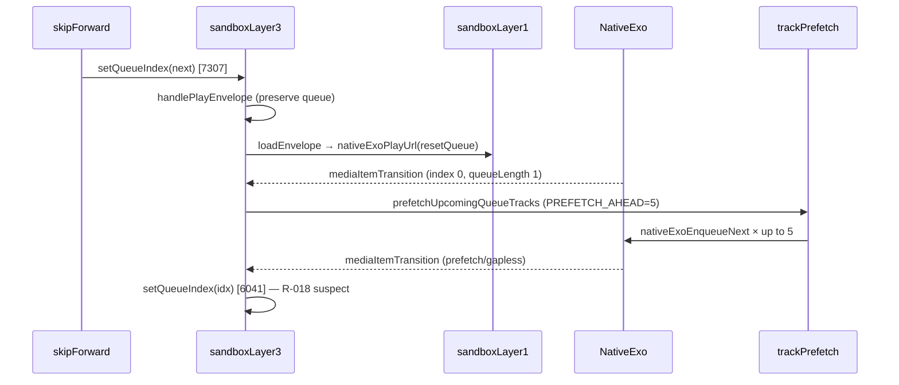

# Consolidated Reviews — Sandbox Ecosystem & sovereign-music-console

**Document date:** 29 July 2026 (expanded consolidation)  
**Primary workspace:** `C:\Users\RH\Downloads\sovereign-music-console`  
**Git branch:** `fix/lock-screen-media-session-and-ui`  
**Git HEAD:** `2925782b5fc94f841b92368e8cc9d950025a9648` — `fix(tidal): stop shipping a shared client secret in every build` (2026-07-29)  
**Working tree at consolidation:** `docs/CONSOLIDATED-REVIEWS.md` is **untracked**; all other paths **clean**

### Verified CI state (re-run 29 Jul 2026, HEAD `2925782`)

| Check | Result |
|-------|--------|
| `npx tsc --noEmit` | **0 errors** |
| `npx vitest run` | **224 files, 1,545 tests, 0 failures** (~40s) |
| God-file lines (measured) | `sandboxLayer3.tsx` **9,659** · `SettingsView.tsx` **6,212** · `lockerStorage.ts` **5,291** · `searchCatalog.ts` **4,924** |

> **Disclaimer:** This document synthesizes read-only audits, traces, and research from the July 2026 review session. It is engineering analysis, not legal advice. Findings tied to older commits (e.g. `325333a`, `a7eb5b6`) are labeled where they may be stale relative to current HEAD.

### Staleness vs committed state

| Topic | Audit commit | At HEAD `2925782` | Action |
|-------|--------------|-------------------|--------|
| Tidal hardcoded secret | Cited in legal audit | **Removed** (`2925782`) | Closed for distributor risk |
| R-018 skip overshoot | Partial at `325333a`; complete fix was uncommitted | Tree clean — fixes **may** be committed; **device proof still required** | Run `queue-skip-probe` on release APK |
| R-004 cached audiobook index freeze | Broken at `325333a`; fix was uncommitted | Re-verify `findQueueIndexForExoTransition` path in `sandboxLayer3.tsx:6004` area | Device test on cached LibriVox chapters |
| Vitest count | 1,263–1,270 at Jul 28 audit | **1,545** now | Doc counts updated above |
| `docs/repository-health.md` | Claimed tsc failures | Still likely stale vs CI | Refresh separately |
| Wrestling EA | Reviewed 29 Jul 2026 | Independent repo; no Music coupling | See Part VI |

---

## Table of Contents

1. [Executive Summary](#executive-summary)
2. [Part I: Sandbox Ecosystem](#part-i-sandbox-ecosystem)
   - [Ecosystem comparison](#ecosystem-comparison)
   - [Per-product summaries](#per-product-summaries)
   - [Cursor workspace map](#cursor-workspace-map)
   - [Sandbox Wrestling (wrestling-booker)](#sandbox-wrestling-wrestling-booker)
3. [Part II: sovereign-music-console Technical Review](#part-ii-sovereign-music-console-technical-review)
   - [CI state](#ci-state)
   - [Three stations](#three-stations)
   - [Playback spine (R-018, R-003, R-004)](#playback-spine-r-018-r-003-r-004)
   - [Bug catalog by severity](#bug-catalog-by-severity)
   - [Architecture debt & strengths](#architecture-debt--strengths)
   - [Fix priority order](#fix-priority-order)
4. [Part III: Search & Architecture Blueprint Gap Analysis](#part-iii-search--architecture-blueprint-gap-analysis)
5. [Part IV: Legal & Compliance](#part-iv-legal--compliance)
   - [Risk assessment](#risk-assessment)
   - [Legal API alternatives & migration matrix](#legal-api-alternatives--migration-matrix)
   - [Store vs self-host flavors](#store-vs-self-host-flavors)
6. [Part V: Repository Inventory](#part-v-repository-inventory)
7. [Part VI: Sandbox Wrestling (wrestling-booker)](#part-vi-sandbox-wrestling-wrestling-booker)
8. [Appendix](#appendix)
   - [Key file references](#key-file-references)
   - [Transcript index](#transcript-index)
   - [Key commands](#key-commands)
   - [Fix priority (ordered)](#fix-priority-ordered)

---

## Executive Summary

The Sandbox product line is a **multi-repo ecosystem** centered on local-first, self-hosted media and creative tooling—not a single monolith. **Sandbox Music** (`sovereign-music-console`) is the most mature runnable product: a React/Capacitor/Tauri music/podcast/audiobook console with a home-server tier (`tier34-server` on port 3001). **sandbox-os** is the public constitution (docs only). **Sandbox Conduit (Builder)** is a private creative workshop (browser, research, AI compile). **sandbox-os-core** is a private bootable Linux chassis (v0.1 ISO). **Sandbox Wrestling** (`wrestling-booker`) is a parallel Godot 4.5 EA territory booker with no code coupling to the OS stack.

**Technical verdict for Music (at audit time, mostly `325333a`–`a7eb5b6`):** CI was green (`tsc` clean, 1,263–1,270 Vitest passes), but **Android playback ship readiness was conditional**. R-018 skip overshoot and R-004 cached-audiobook index freeze were addressed in working-tree changes that were **uncommitted at the Jul 28 full bug audit**; HEAD has since advanced (`2925782`) with Tidal secret removal and search fixes—**re-verify playback on device** before treating R-018/R-004 as closed.

**Architecture:** ~40–50% of a pasted “Global Multimedia Search Engine” blueprint is embodied in code (tiered fan-out, dice/fuzzy scoring, narrow RRF, M4B/Calibre libraries, spoken-word DSP); RRF is not applied to locker+catalog play search, M4B chapters are parsed but not wired to UI, and podcast “semantic search” is Whisper + substring, not vectors.

**Legal:** Not everything is clearly legal for a **commercial distributor** shipping default yt-dlp/debrid/scrape paths. Self-hosted personal use with owned files and PD catalogs is lower risk. GPL-3.0 project license vs `package.json` MIT is inconsistent. Hardcoded Tidal credentials were a distributor risk—**mitigated at HEAD `2925782`**.

**Recommended operator stance:** Treat Music as **beta for personal/self-host**; gate store builds behind licensed SDK + locker/PD paths; commit and device-verify any remaining playback bundle; extend RRF with stable dedup keys before rewriting search; keep locker-first model for offline compliance.

### Session findings at a glance

| Review | Key takeaway |
|--------|--------------|
| Full bug audit (`325333a`) | CI green; playback fixes uncommitted; ship blocked without device verify |
| Earlier audit + scores | Overall ship readiness **6/10**; god files growing |
| R-018 trace | Prefetch storm + adopted transitions = leading hypothesis |
| Blueprint gap | RRF exists but narrow; M4B/Calibre parsers unwired |
| Legal compliance | Self-host OK; store/commercial needs feature stripping |
| Legal API research | No drop-in licensed streaming + locker; hybrid OAuth + PD |
| Repo inventory | 4 deployables, 11 Android plugins, 224 tests |
| Cursor map | 5 real workspaces + Wrestling; no cursorfs-clone |
| Ecosystem 4 projects | Music public beta; OS docs; Conduit private; os-core ISO |
| Wrestling EA | Godot v0.5; sim-first; no OS integration |

### HEAD delta since audits

| Commit / state | Change relevant to reviews |
|----------------|---------------------------|
| `325333a` → `2925782` | Tidal shared secret removed; search relevance fixes |
| Working tree at `325333a` | 9 modified playback files (may now be committed—verify) |
| Working tree at `2925782` | **Clean** |
| Legal audit cited hardcoded Tidal | Addressed by `2925782` |

---

## Part I: Sandbox Ecosystem

### Ecosystem comparison

| Product | Path | One-line pitch | Ships | Maturity | Public? |
|---------|------|----------------|-------|----------|---------|
| **Sandbox Music** | `Downloads\sovereign-music-console` | Self-hosted music/podcast/audiobook player + home server | Web, Tauri desktop, Android APK, Docker tier34 | Beta (v0.2.0-beta cited in docs) | **Yes** — `Ryan-Howard-Dev/sovereign-music-console` |
| **Sandbox OS** | `Downloads\sandbox-os` | Vision, decisions, specs, audits—not an installable OS | Docs only | Production-quality documentation | **Yes** — `Ryan-Howard-Dev/sandbox-os` |
| **Sandbox Conduit (Builder)** | `Downloads\sandbox-conduit (1)` | Creative workshop: Tide browser, Ocean research, Sand compile, Reef media | Web + Tauri (local copy uncommitted) | Beta / private WIP | **Private** app; **public docs** at `sandbox-builder-docs` |
| **sandbox-os-core** | `Downloads\sandbox-os-core` | Bootable Linux + Spread USB + shell launcher | ISO ~493 MB (`sandbox-os-0.1-amd64.iso`) | Early lab v0.1 | **Private** (no git on disk) |
| **Sandbox Wrestling** | `Projects\wrestling-booker` | Territory wrestling booker — office loop + beat-sheet matches | Godot → Windows `.exe` | EA v0.5.0-ea, pre-Steam | **Policy split** — GPL slim clone vs “private until Steam” docs |

**Ports (Music):** UI **3002**, Sandbox Server (tier34) **3001**. **Conduit:** UI **5174**.

**Strategic arc:** Music validates **server + locker**. Builder validates **creative stations**. os-core validates **boot + spread**. sandbox-os holds **story and decisions**. Wrestling is a **parallel indie simulation** aligned with Music's philosophy, not a Conduit module.

**Owner quick reference — what you can do today:**

| Goal | Where |
|------|-------|
| Ship/share music app + home server | sovereign-music-console (public, beta) |
| Explain Sandbox vision to partners | sandbox-os (public docs) |
| Onboard Builder operators without source | sandbox-builder-docs (public site) |
| Run creative workshop locally | sandbox-conduit (1) (private) |
| Boot PC into Sandbox 0.1 VM | sandbox-os-core ISO |
| Play territory booker EA | wrestling-booker (Godot, Windows) |

### Per-product summaries

#### sovereign-music-console (Sandbox Music)

- **Stack:** React 19, TypeScript, Vite 6, Tailwind 4; Express UI server; `tier34-server` (Express + WebSocket); Tauri 2 + Capacitor 8 Android; optional Docker (Meilisearch, slskd, Demucs).
- **Stations:** Music (Collection/Locker/Home), Podcasts, Audiobooks—three product pillars sharing one playback shell.
- **Relationship:** Hosts **tier34**; Conduit and future stations are clients. Referenced by sandbox-os and os-core health checks.

#### sandbox-os

- **Stack:** Markdown specs, Diátaxis docs, WSL helper scripts—no `package.json`.
- **Relationship:** Parent narrative; cross-links Music and Conduit; defines station constitutions and Spread/Vault/Ghost specs.
- **Note:** Runnable shell/ISO explicitly live in **sandbox-os-core**, not this repo.

#### Sandbox Conduit (Builder)

- **Stack:** React 19, Vite, Express (`server.ts` ~2k lines), Tauri 2, optional Clerk/Stripe, Gemini/BYOK, Playwright E2E.
- **Stations inside Builder:** Horizon (home), Tide (browser), Ocean (research), Sandstone (planning), Sand (AI compile), Reef (media), Shore (audio brand).
- **Related paths:** `sandbox-builder-docs` (public Sphinx site); `Documents\Sandbox Builder` (older prototype, port 5173, no Tauri).

#### sandbox-os-core

- **Stack:** Debian bookworm live-build, sway/labwc, Node shell on 127.0.0.1:3002, Spread Host CLI.
- **Relationship:** Boots PC into Sandbox; expects Tide binary from Conduit; probes tier34 from Music repo (run separately today).

#### sandbox-os-core (expanded)

- **Boot flow:** Debian live → sway → Sandbox Home launcher (127.0.0.1:3002) → station stubs; tier34 health shows offline in VM unless host runs Music's server.
- **Spread Host v0:** USB writer script (`spread/host/spread-host.mjs`); phone-to-phone Spread is documentation-only in sandbox-os.
- **Build:** `image/build-iso.sh` → `image/out/sandbox-os-0.1-amd64.iso` (~493 MB); QEMU scripts for Windows/WSL smoke (`scripts/run-qemu.ps1`).
- **Expects from Conduit:** Tide browser binary at `/opt/sandbox/stations/browser/`.
- **Key paths:** `shell/` (Wayland session), `stations/browser/`, `server/health-check.mjs`, `docs/ARCHITECTURE.md`.

#### Sandbox Conduit / Builder (expanded)

| Station | User-facing role |
|---------|------------------|
| Horizon | Home launcher for all Builder stations |
| Tide | Private browser ("THE TIDE") — also standalone Tauri (`src-tauri-browser/`) |
| Ocean | Scholar search + research vault |
| Sandstone | Planning templates |
| Sand | AI compile → projects and packaging |
| Reef | Media timeline / export |
| Shore | Audio brand kit |

**Capability map** (`sandbox-builder-docs/docs/status.rst`): local UI and offline compile **ready**; BYOK chat, sovereign LLM, Harbor deploy **beta**; WASM compile **stub**; P2P generation **blocked**.

**Scale:** ~233 TypeScript/TSX files in `src/` (vs ~786 in Music). `server.ts` ~2k lines with tenant routing, compile quotas, vault. Playwright E2E (13 specs). Git on disk had **zero commits, no remote** at ecosystem survey — private WIP.

**Related paths:** `sandbox-builder-docs` (public Sphinx → GitHub Pages); `Documents\Sandbox Builder` (older prototype, port 5173, no Tauri).

### Cursor workspace map

Active Cursor projects (from `C:\Users\RH\.cursor\projects` + `workspaceStorage`):

| # | Cursor folder | Workspace path | Notes |
|---|---------------|----------------|-------|
| 1 | `c-Users-RH-Downloads-sovereign-music-console` | `Downloads\sovereign-music-console` | Primary; ~1269 agent transcript files |
| 2 | `c-Users-RH-Downloads-sovereign-music-console-1` | `Downloads\sovereign-music-console (1)` | Duplicate scaffold; no `.git` |
| 3 | `c-Users-RH-Downloads-sandbox-os` | `Downloads\sandbox-os` | Docs portfolio |
| 4 | `c-Users-RH-Downloads-sandbox-conduit-1` | `Downloads\sandbox-conduit (1)` | Builder |
| 5 | `c-Users-RH-Projects-wrestling-booker` | `Projects\wrestling-booker` | Godot game |
| 6 | `empty-window` | (no folder) | Agents without workspace |

**Other git repos on disk:** `sandbox-builder-docs`, `smc-backup.git` (bare backup → Music), nested `annas.koplugin`. **No `cursorfs-clone` folders found.**

| Path | Type | Git? |
|------|------|------|
| `Downloads\sandbox-builder-docs` | Public Builder docs (Sphinx) | Yes |
| `Downloads\smc-backup.git` | Bare backup of Music | Bare |
| `Downloads\sovereign-music-console (1)` | Duplicate scaffold | No |
| `Documents\knowledge-os` | Vite prototype | No |
| `Documents\Sandbox Builder` | Older Conduit (port 5173) | No |
| `Projects\sandbox-wrestling-docs` | Public Wrestling docs | No `.git` locally |

**Ephemeral Cursor entries:** numeric folders `1780396964932` … `1784039126187` (canvases/terminals only, no path metadata); five `AppData\Local\Temp\{uuid}` MCP shells.

**Not user apps:** `C:\Users\RH\.cursor\plugins\cache\cursor-public\` — marketplace plugin caches (Vercel, Harness, Bright Data, etc.).

### Sandbox Wrestling (wrestling-booker)

| Dimension | Detail |
|-----------|--------|
| **Pitch** | Territory booker: office → card builder → beat-sheet match engine → sim show; biological stress, critics, dynasty emerging |
| **Stack** | Godot 4.5.2, GDScript, GPL-3.0, ~1,184 `.gd` files (~224k LOC), 67 runtime autoloads |
| **Ships** | Windows x86_64 export only; EA exe presets; **3D playback off** (`USE_3D_PLAYBACK := false`); Steam stub |
| **Maturity** | **EA v0.5.0-ea** — office loop + match engine delivered; expansion/corporate/grand-strategy gated; rivals simulate-only |
| **Ecosystem** | No code refs to Music/OS/Conduit/os-core; docs cite same design ethos as Music |
| **Docs** | `Projects\sandbox-wrestling-docs` — public Diátaxis (CC BY 4.0); game tree publishing policy inconsistent (GPL public clone vs private-until-Steam) |
| **CI** | Windows GitHub Actions: compile, smoke, 99 verify harnesses, stability gate |
| **Health** | Strong test gates; god files (`main_shell.gd` ~1,599 lines, `match_playback_engine.gd` ~1,479) |

**Game systems — delivered vs stubbed:**

| System | Status |
|--------|--------|
| Match engine + `.wbm` editor | **Delivered** |
| Workshop (local templates) | **Delivered** |
| Worker DB + biological stress | **Delivered** |
| Promotion mode + Sim Show | **Delivered** |
| Career / dojo / poaching | EA preview |
| Dynasty chronicle UI | Emerging |
| Living world / AI rivals | Backend-heavy; rivals not playable |
| Expansion / territories UI | Gated (`expansion: false`) |
| Corporate / stock / grand strategy | Gated off |
| 3D ring playback | **Off** in EA |
| Steam achievements/cloud | Stub (`steam_manager.gd`) |

**Key paths:** `project.godot`, `project.test.godot` (145 test autoloads), `project.release.godot` (generated shipping), `release/game_version.gd`, `systems/` (~449 `.gd`), `ui/shell/main_shell.gd`, `engine/v1/match_engine.gd`, `docs/EA_SCOPE.md`, `docs/ROADMAP.md`, `.github/workflows/compile-gate.yml`.

**Backup:** `wrestling-booker-backup-consolidation-20260616-031659` — pre-territory-booker prototype archive (June 2026); main scene was `scenes/ring_playback.tscn`.

---

## Part II: sovereign-music-console Technical Review

> **Staleness note:** Bug audits below were verified at commits **`325333a`** (Jul 28) and **`a7eb5b6`** (blueprint gap). Current HEAD **`2925782`** has a **clean working tree** and includes Tidal secret removal + search relevance fixes. Playback fixes that were **uncommitted at `325333a`** may now be committed—**confirm with `git log` and device E2E** before relying on status columns.

### CI state

| Check | Result (audits at `325333a` / `a7eb5b6`) | At HEAD `2925782` (verified 29 Jul) |
|-------|-------------------------------------------|-----------------------------------|
| `npx tsc --noEmit` | **0 errors** | **0 errors** |
| `npx vitest run` | **205 files, 1,270 tests, 0 failures** | **224 files, 1,545 tests, 0 failures** |
| `downloadQueueRunner.test.ts` | Passed (historically flaky) | Passed in latest run |
| Working tree | **Dirty** at `325333a` (9 modified + 2 untracked) | **Clean** (except this doc) |

**God-file line counts:**

| File | Jul 28 audit | Measured 29 Jul (`2925782`) |
|------|-------------:|----------------------------:|
| `src/sandboxLayer3.tsx` | ~9,574–9,593 | **9,659** |
| `src/stations/SettingsView.tsx` | ~6,212 | **6,212** |
| `src/lockerStorage.ts` | ~5,077 | **5,291** |
| `src/searchCatalog.ts` | ~4,758 | **4,924** |

**Doc drift:** `docs/repository-health.md` still claimed tsc failures and fewer tests at audit time—stale vs HEAD.

### Three stations

The product has **three content pillars** (Music, Podcasts, Audiobooks) sharing one playback shell (`sandboxLayer3.tsx`), one native Exo queue, and one locker vault. Station isolation is **conventional** (shared `playQueue`), not enforced by type system.

#### Music (CollectionView, LocalView, HomeView)

**Architecture:** Music is the default station and the most mature surface. `CollectionView` and `LocalView` browse locker + catalog; `HomeView` shows discovery shelves. Search uses dual stack: `runUnifiedSearch` (dropdown) vs `engineSearch` → `tieredFanOut` (tap-to-play). Playback flows through `handlePlayEnvelope` → `sandboxLayer1` audio FSM → native Exo on Android.

**Key modules:** `searchCatalog.ts` (~4.9k lines), `lockerStorage.ts`, `unifiedSearch.ts`, `sandboxLayer2.ts` (provider fan-out), `CollectionView.tsx`, `LocalView.tsx`, `HomeView.tsx`.

**Strengths:** Locker vault with Meilisearch index; archive.org torrent-verified offline caching; discovery shelves; Android Auto + Cast; replay gain; gapless native queue; air-gap gating on Layer 2 search (R-009 fixed).

**Bugs / gaps:**

| ID | Issue | Location | Severity |
|----|-------|----------|----------|
| R-001 | Mobile resolve bypasses catalog match | `playbackPipeline.ts:242` | Critical |
| R-018 | Skip overshoot on music queues (device) | `trackPrefetch.ts:36`, `sandboxLayer3.tsx:6004` | Critical |
| R-021 | Fast-boot optimistic `offlineReady` | `lockerStorage.ts:4185–4190` | High |
| R-008 | Multi-store locker drift | `lockerStorage.ts` throughout | High |
| — | Shared `playQueue` across stations | architectural | Medium |
| — | Music-only queue skip under-tested on device | E2E gap | Medium |

**Playback transport:** Music uses **track skip** (`skipForward` advances queue index). Distinct from spoken-word interval seek.

#### Podcasts (PodcastsView, podcastPlayback)

**Architecture:** Library/Discover split in `PodcastsView.tsx`. Subscription via RSS/OPML (`podcastCatalog.ts`); discovery via Podcast Index (`podcastIndexProvider.ts`). Mirror sync on tier34 (`routes/podcastMirror.ts`). Transcripts via Whisper on tier34 (`whisperRunner.ts`, `podcastTranscriptStorage.ts`). Podping live refresh (`podpingWatcher.ts`). Sovereign Up Next in `subscribeEnded` (`sandboxLayer3.tsx:6516–6528`).

**Key modules:** `podcastPlayback.ts`, `podcastSearch.ts`, `podcastTranscriptSearch.ts`, `podcastNamespace.ts`, `PodcastsView.tsx`, `podcastVoiceBoost.ts`, `speechClarity.ts`.

**Strengths:** Podcasting 2.0 namespace tags; LAN mirror; lexical + transcript search merge; ad-skip and chapter sheets in shell; proxy URL unwrap for native playback (tested).

**Bugs / gaps:**

| ID | Issue | Location | Severity |
|----|-------|----------|----------|
| — | Mirror pull errors generic, no retry | `PodcastsView.tsx:611` | Medium |
| H-1 | Tier34 podcast routes unauthenticated on LAN | `tier34-server/index.ts` | High |
| — | Skip is **seek**, not chapter advance | `spokenWordPlayback.ts`, E2E `queue-skip-probe` | By design |
| — | Sovereign Up Next + shuffle/repeat complexity | `sandboxLayer3.tsx:6516+` | Medium (no device E2E) |
| — | YouTube-as-podcast inherits yt-dlp risk | `tier34-server/lib/podcastYoutube.ts` | Legal |

**Playback transport:** `usesIntervalSeekTransport` — skip seeks within episode; does not advance queue like music.

#### Audiobooks (AudiobooksView, audiobookCatalog)

**Architecture:** Tab layout in `AudiobooksView.tsx` (fixed at `325333a`). Catalog from LibriVox, Archive.org, Gutenberg, scrape providers on tier34. Device scan groups multi-file books (`audiobookLibrary.ts`). Acquire path: magnets + Real-Debrid via tier34 (`audiobookAcquireCore.ts`). EPUB import via `epubImport.ts` / `BookShelf.tsx`. M4B chapter parser exists (`m4bChapters.ts`, `lockerAudiobookChapters`) but **not wired to UI**.

**Key modules:** `audiobookCatalog.ts`, `audiobookCatalogPlayback.ts`, `audiobookPlayback.ts`, `audiobookScrapeClient.ts`, `AudiobooksView.tsx`, `AudiobookDiscoverPanel.tsx`, `calibreLibrary.ts` (tests only).

**Strengths:** LibriVox fragment repair; Archive.org torrent piece hashing for offline cache; tier34 scrape with CF abort (no bypass); EPUB DRM correctly rejected; biological chapter grouping for multi-MP3 books.

**Bugs / gaps:**

| ID | Issue | Location | Severity |
|----|-------|----------|----------|
| R-018 | Skip overshoot on 49-chapter LibriVox (9→16, 16→22) | device repro | Critical |
| R-004 | Cached chapter index freeze (`content://` vs `https://`) | `sandboxLayer3.tsx:5906` vs `6004` | Critical |
| R-002 | Acquire sends Prowlarr/RD keys to tier34 | Settings → tier34 | High |
| M-6 | LibriVox/archive WAN fallbacks skip air-gap | `audiobookCatalog.ts:278+, 352+` | Medium |
| — | M4B embedded chapters not used | `lockerStorage.ts:4726+` no callers | Gap (not bug) |
| — | EPUB DRM rejection | `epubParse.ts:151` | **Correct behavior** |

**Playback transport:** Catalog LibriVox uses **chapter queue** (distinct URLs per chapter) — same skip path as music, which triggers R-018. Device-local audiobooks (`audiobook:` prefix) use interval seek in `skipForward` (`7200–7209`) — different path.

#### Cross-station interactions

| Interaction | Behavior | Risk |
|-------------|----------|------|
| Shared `playQueue` | Switching stations does not auto-clear queue | Stale queue if user expects isolation |
| Shared native Exo session | One ExoPlayer for all stations | Transition handler must disambiguate by envelope type |
| Spoken-word vs music skip | `usesIntervalSeekTransport` branch at `7168` | Podcast/audiobook E2E won't catch music skip bugs |
| Locker blobs | Same vault for music, podcast enclosures, audiobook files | R-008 multi-store drift affects all stations |
| tier34 dependency | Podcast mirror, transcripts, audiobook acquire/scrape | LAN trust model (H-1) |

### Playback spine (R-018, R-003, R-004)

#### R-018 — Skip overshoot (5–7 tracks)

**Repro:** OnePlus device, `sandboxmusic://e2e/queue-skip-probe?skips=1`. Skip resolves correct envelope; native `mediaItemTransition` at `index:0 queueLength:1`; index climbs while `enqueueNext` + prefetch burst runs (`PREFETCH_AHEAD = 5`).

| Layer | Committed at `325333a` | Uncommitted at `325333a` |
|-------|----------------------|--------------------------|
| 3s JS navigation ownership window | Present (`5a4f3cf`) | Present |
| Reject `PLAYLIST_CHANGED` / `SEEK` | Absent | Present (`queueAdvanceGate.ts`) |
| Native `mediaId` on transitions | Partial / no | Full (`NativeExoPlaybackPlugin.java`) |
| `findQueueIndexForExoTransition` | URL-only at HEAD | mediaId-first in working tree |

**Leading hypothesis (ranked):** (1) post-skip prefetch storm + adopted native transitions; (2) gate allows prefetched-track transitions past echo window; (3) `enqueueNext` races `resetQueue`; (4) `subscribeEnded` double-advance; (5) URL-only reconciliation mis-association.

**Audiobook skip call chain (catalog LibriVox):** `skipForward` → `setQueueIndex` → `handlePlayEnvelope` (preserve queue) → `resolveAudiobookCatalogEnvelopeForPlayback` → `audio.loadEnvelope` → `nativeExoPlayUrl(resetQueue:true)` → prefetch `useEffect` on `queueIndex` → optional `onExoTransition` → `setQueueIndex`.

#### R-003 — Dual queue authority

- **~38–39 `setQueueIndex` call sites** in `sandboxLayer3.tsx`.
- JS owns `playQueue` + `queueIndex`; native Exo owns `MediaItem` queue.
- Reconciliation: **`findQueueIndexForExoUrl`** in production; **`findQueueIndexForExoTransition`** tested but unused at HEAD (dead path until mediaId fix lands).
- **Queue owner is JavaScript**, not Rust/native.

#### R-004 — subscribeEnded vs gapless

- Three `subscribeEnded` handlers; `shouldSuppressJsAdvanceAfterNativeGapless` (4s window).
- Partly mitigated by `shouldAdoptNativeExoTransition` + `lastJsInitiatedNativeNav()`.
- Not CI-verifiable with real native queue (`play-direct-queue` E2E leaves handler inert).

**Why mediaId fix was reverted:** Stable mediaId matching worked “too well”—matched JS-initiated skips, causing **second** `setQueueIndex`. URL matching often missed, masking the defect. Risk register blocked re-landing until R-018 root cause isolated.

#### Complete `setQueueIndex` mutation surface (`sandboxLayer3.tsx`)

Measured **38 call sites** (excluding `useState` declaration and callback references passed to helpers):

| Line | Context | Skip-relevant? |
|------|---------|----------------|
| `3247` | Remote Connect command | No |
| `3348` | Queue seed from URL/deep link | No |
| `3456` | Play single track (collapse queue) | No |
| `3473` | Play from hit list | No |
| `3518` | `handlePlayEnvelope` — sync index to track | **Yes** (audiobook branch) |
| `3579` | `handlePlayEnvelope` — state resync | Conditional |
| `3641` | `handlePlayEnvelope` — audiobook catalog branch | **Yes** |
| `3764` | Podcast envelope branch | No |
| `3814` | Playlist envelope branch | No |
| `3877` | Radio/mix envelope branch | No |
| `3981` | Generic envelope index sync | Conditional |
| `4294` | Post-load index correction | No (audiobook early return) |
| `4564` | Clear queue on station change | No |
| `4579` | New queue from album play | No |
| `4592` | Queue from discovery shelf | No |
| `4969` | DJ station queue inject | No |
| `5348` | Podcast chapter jump | No |
| `5445` | Podcast queue rebuild | No |
| `6004` | **`onExoTransition` adopted** | **Yes — prime R-018 suspect** |
| `6098` | Queue restore from persistence | No |
| `6630` | Mix/radio extend queue | No |
| `6668` | Connect remote advance | No |
| `6685` | `subscribeEnded` auto-advance | Conditional |
| `6701` | `subscribeEnded` secondary write | Conditional |
| `6743` | Skip backward — wrap to end | No |
| `6746` | Skip backward — decrement | No |
| `6751` | Skip backward — in-place seek fallback | No |
| `6793` | Functional update (shuffle) | No |
| `6807` | Queue clear | No |
| `6902` | Play queue at index | No |
| `7200` | `skipForward` — in-place seek branch | Unlikely (chapters) |
| `7205` | Device-local audiobook interval seek | No (catalog path) |
| `7283` | **`skipForward` main advance** | **Yes** |
| `7291` | `skipForward` duplicate write | **Yes** |
| `7524` | E2E / dev action injection | Test only |

**Callbacks passing `setQueueIndex`:** lines `4386`, `6651` — delegated to `queueAdvancePolicy` helpers.

**Ref mirror:** `queueIndexRef.current` updated every render (~`5997`) and on resync paths.

#### R-018 skip path (sequence — full trace from subagent `20de8009`)



#### Primary `setQueueIndex` sites during audiobook chapter skip

| File:Line | Trigger | Reaches skip? |
|-----------|---------|---------------|
| `sandboxLayer3.tsx:7307` | `skipForward` main advance | **Yes** |
| `sandboxLayer3.tsx:3652` | `handlePlayEnvelope` audiobook branch | **Yes** |
| `sandboxLayer3.tsx:6041` | `onExoTransition` adopted | **Yes — prime suspect** |
| `sandboxLayer3.tsx:6722` | `subscribeEnded` auto-advance | Conditional |
| `sandboxLayer3.tsx:7202–7209` | Device-local audiobook interval seek | No (catalog path) |

#### Ranked race hypotheses (R-018)

| Rank | Hypothesis | Why it fits 5–7 jumps |
|------|------------|----------------------|
| 1 | Post-skip prefetch + adopted transitions | `PREFETCH_AHEAD=5`; each adoption calls `setQueueIndex` and retriggers prefetch |
| 2 | Gate allows non-echo prefetched transitions | Only blocks echo matching `pendingJsNavEnvelopeId`; N+2…N+5 adopted |
| 3 | `enqueueNext` chain races `resetQueue` | Serialized chain may append after `playUrl` clear |
| 4 | `subscribeEnded` double-advance | Gapless suppress only when `queueIndex > endedIdx` |
| 5 | URL-only `findQueueIndexForExoUrl` mis-association | Redirects, blob vs https mismatch |
| 6 | Stream-cache mints new blob URLs during skip window | Parallel enqueue work |
| 7 | Native AUTO gapless drain | Less consistent with instant overshoot |

### Bad code patterns (not just bugs)

| Pattern | Evidence | Impact |
|---------|----------|--------|
| Monolithic shell | `sandboxLayer3.tsx` ~9.6k lines, ~444 hooks | High regression risk per change |
| Scattered queue mutation | 38–39 `setQueueIndex` sites | No single advance owner |
| Intentionally weak URL matching | Comments at `sandboxLayer3.tsx:5891–5895` | Suppresses some bugs, causes others |
| Swallowed errors | 50+ `.catch(() => undefined)` | Silent prefetch/locker/heal failures |
| Static E2E in `main.tsx` | `__SANDBOX_ANDROID_E2E__` preload | Correct for test APK; hazardous if flag leaks to store |
| Dead reconciliation helper | `findQueueIndexForExoTransition` tested, unused at HEAD | Reverted-fix debt |
| Risk register drift | R-009 closed in code, open in register | Operator confusion |

### Viability gates (corrected)

| Gate | Status at audit |
|------|-----------------|
| Device re-verify R-018 (`queue-skip-probe`) | **NOT MET** — fix may exist; proof does not |
| Queue owner clarity | **MET** — JS owns queue; native reconciles |
| Locker encryption failure | **NOT a gate** — EPUB DRM rejection is correct |
| tsc + unit tests | **MET** |
| Phone E2E on release APK | **NOT MET** (R-020) |
| Single advance owner | **NOT MET** |

### Bug catalog by severity

#### Critical

| ID | Issue | Location | Status at `325333a` | Notes at `2925782` |
|----|-------|----------|---------------------|-------------------|
| C-1 | R-018 skip overshoot | `queueAdvanceGate.ts`, `trackPrefetch.ts:36`, `sandboxLayer3.tsx` | Partial fix at HEAD; complete fix uncommitted | **Re-verify on device** |
| C-2 | R-004 cached audiobook index freeze | `sandboxLayer3.tsx:5906` vs `5909+` | Broken at HEAD; fixed uncommitted | **Re-verify** |
| C-3 | R-001 wrong-track (mobile bypass) | `playbackPipeline.ts:242` | Open | Likely still open |
| C-4 | Ship from clean checkout without playback bundle | git status | Process risk at `325333a` | Tree clean—confirm fixes committed |

#### High

| ID | Issue | Location |
|----|-------|----------|
| H-1 | Tier34 LAN endpoints unauthenticated (locker, acquire, proxy) | `tier34-server/index.ts` |
| H-2 | Defense protocol GET unauthenticated | `tier34-server/index.ts:275–281` |
| H-3 | Credentials in JSON POST bodies (R-002) | Settings → tier34 |
| H-4 | Dual queue authority (38+ `setQueueIndex` sites) | `sandboxLayer3.tsx` |
| H-5 | Multi-store locker drift (R-008) | `lockerStorage.ts` |
| H-6 | Fast-boot `offlineReady` optimism (R-021) | `lockerStorage.ts` |
| H-7 | E2E not in release builds (R-020) | `android/app/src/debug/AndroidManifest.xml` |
| H-8 | Lock-screen stale artwork | Native plugin (mitigated partially) |

#### Medium

| ID | Issue | Location |
|----|-------|----------|
| M-1 | Tombstone sync no-op (R-010) | `lockerSync.ts:435–443` |
| M-2 | Stale tier34 reachability cache 30s (R-016) | `src/tier34/client.ts` |
| M-3 | Hardcoded Piped/Invidious (R-017) | `src/pipedMobile.ts` |
| M-4 | Vault load failure → empty locker | `lockerStorage.ts:4197–4200` |
| M-5 | Silent `.catch(() => undefined)` (50+ sites) | locker/sync/prefetch |
| M-6 | Air-gap gaps on audiobook WAN fallbacks | `audiobookCatalog.ts` LibriVox/archive paths |
| M-7 | Docs stale vs CI | `docs/repository-health.md` |
| M-8 | OAuth callback exposes token in HTML | `tier34-server/index.ts:1499` |

#### Low

| ID | Issue |
|----|-------|
| L-1 | God-file maintainability (`sandboxLayer3`, `SettingsView`) |
| L-2 | No TODO/FIXME markers in `src/` — debt in risk register only |
| L-3 | Flaky `downloadQueueRunner.test.ts` (passed in last audit run) |
| L-4 | Linux/macOS packaged desktop lacks bundled Node (R-007) |

**Scores /10 (Jul 27 audit):** Feature breadth 8 · Maintainability 4 · Unit tests 8 · Device/E2E 5 · Android playback reliability 5 · Security (LAN) 6 · Doc accuracy 5 · Offline/local-first 8 · **Overall ship readiness 6**.

### Top 25 issues (broader inventory)

| # | Sev | Issue | Location |
|---|-----|-------|----------|
| 1 | C | R-018 skip overshoot | `trackPrefetch.ts:36`, `sandboxLayer3.tsx` |
| 2 | C | R-001 mobile bypass | `playbackPipeline.ts:242` |
| 3 | C | URL-only queue reconciliation | `sandboxLayer3.tsx:6025` |
| 4 | H | subscribeEnded vs gapless | `sandboxLayer3.tsx:6579+` |
| 5 | H | `findQueueIndexForExoTransition` unused | `exoQueueSync.ts` |
| 6 | H | Native transition url-only | `NativeExoPlaybackPlugin.java` |
| 7 | H | Tombstone no-op | `lockerSync.ts:435–443` |
| 8 | H | God shell + locker | `sandboxLayer3.tsx`, `lockerStorage.ts` |
| 9 | H | Credentials in POST (R-002) | tier34 + Settings |
| 10 | H | Prefetch on queueIndex | `sandboxLayer3.tsx:5951` |
| 11 | H | Tier34 spawn silent (R-005) | launcher |
| 12 | H | Locker multi-store drift (R-008) | `lockerStorage.ts` |
| 13 | M | Audiobook WAN no air-gap | `audiobookCatalog.ts` |
| 14 | M | Doc drift R-009 | audit vs `sandboxLayer2.ts` |
| 15 | M | Duplicate R-018 ID | `risk-register.md` |
| 16 | M | EnqueueNext swallows errors | `androidNativePlayback.ts` |
| 17 | M | Stale tier34 cache (R-016) | `tier34/client.ts` |
| 18 | M | E2E not release (R-020) | debug manifest |
| 19 | M | queue-skip-probe not CI | `e2eDevAction.ts` |
| 20 | M | Vault load → empty locker | `lockerStorage.ts` |
| 21 | M | OAuth token in HTML | `tier34-server/index.ts` |
| 22 | L | Deprecated prefetch alias | `trackPrefetch.ts:244` |
| 23 | L | Half-finished mediaId metadata | Java plugin |
| 24 | L | Flaky downloadQueueRunner | test harness |
| 25 | L | No inline TODO markers | grep empty |

### Architecture debt & strengths

**Debt:**

- Monolithic `sandboxLayer3.tsx` (~9.6k lines, ~444 hooks).
- Scattered queue mutation despite extracted policy (`queueAdvanceGate`, `exoQueueSync`, `queueAdvancePolicy`).
- Provider credentials browser → tier34; three parallel manifest models.
- Intentionally weak URL transition matching (comments document tradeoff).

**Strengths:**

- 1,263+ unit tests; playback policy tests (`queueAdvanceGate.test.ts`, `exoQueueSync.test.ts`).
- Air-gap gating on Layer 2 search (R-009 fixed + tested).
- Locker delete guards; tombstone no-op by design (data-loss prevention).
- Spoken-word transport separation (`usesIntervalSeekTransport`).
- Honest risk register with device reproduction notes.
- Native Exo investment: gapless, replay gain, speech clarity, Android Auto.

### Fix priority order

1. **Device-verify** `queue-skip-probe` on music + cached audiobook chapters (release APK path).
2. **Confirm** R-018/R-004 fixes are committed at HEAD; update risk register only after device proof.
3. **R-001:** Remove unconditional mobile bypass in `resolvedStreamMatchesCatalog`.
4. **Tier34 auth** on locker/proxy/acquire when `TIER34_DEVICE_SYNC_SECRET` set.
5. **Centralize queue advance** — single owner; migrate `setQueueIndex` sites incrementally.
6. **R-021:** Full playability probe after boot before showing play buttons.
7. **God-file extraction** — continue `src/play/`, `src/shell/` splits.
8. **Docs refresh** — `repository-health.md`, dedupe R-018 IDs in risk register.
9. **Release E2E strategy** — document debug-only vs release-safe probes.
10. **Lower priority:** R-017 instance rotation, R-016 TTL, launcher stderr (R-005).

---

## Part III: Search & Architecture Blueprint Gap Analysis

**Blueprint topics vs codebase (audit at `a7eb5b6`):** ~40–50% embodied, ~30% library-only/unwired, ~20% aspirational.

### Section gap table (blueprint §2.1–§2.9, audit at `a7eb5b6`)

#### §2.1 Partial-match scoring (Jaro, Bitap, BM25, length penalty)

| Dimension | Detail |
|-----------|--------|
| **Current** | Dice coefficient (`sandboxLayer2.ts:1647–1737`); fuzzy tokens (`searchCatalog.ts:193–218`, `806–817`); tiered relevance in `sortSearchHits` (`1398–1447`) with remix/exclusive-album penalties |
| **Gap** | No Jaro-Winkler, Bitap, BM25, or explicit length-ratio penalty |
| **Priority** | **Medium** — existing fuzzy layer handles many typos; regression risk on tuned heuristics |

#### §2.2 Reciprocal Rank Fusion (locker + catalog + web)

| Dimension | Detail |
|-----------|--------|
| **Current** | `rankFusion.ts` (`RRF_K=60`); used only in `unifiedSearch.ts:605–622` (`applyWebSupplementToUnified`). Play search (`engineSearch` → `tieredFanOut`) uses `sortSearchHits`, **not RRF** (`sandboxLayer2.ts:1762–1948`). Dropdown uses additive `SOURCE_RANK` + `mergeRankedTracks` (`unifiedSearch.ts:87–219`) |
| **Gap** | RRF proven in `rankFusion.test.ts` but not applied to locker+iTunes+tier34 fan-out |
| **Priority** | **High** — documented failure mode in `rankFusion.ts:15–18`; incremental path exists |

#### §2.3 ICU multilingual tokenization / transliteration

| Dimension | Detail |
|-----------|--------|
| **Current** | Unicode NFD + strip combining marks (`searchCatalog.ts:655–658`, `lockerStorage.ts:1144–1147`, `unifiedSearch.ts:94–101`). 18 JSON locales in `src/i18n/` |
| **Gap** | No ICU, transliteration tables, or script-aware tokenization; CJK/Arabic/Thai rely on substring after light normalization |
| **Priority** | **Medium–Low** Western-music-first; **High** if global catalogue is a goal; APK bundle cost |

#### §2.4 Classical music ontologies (BWV, KV, Op.)

| Dimension | Detail |
|-----------|--------|
| **Current** | Display only: `isClassicalGenre` (`albumCredits.ts:434–436`); MusicBrainz composer/soloist (`100–199`); classical subtitles in `LocalView.tsx` / `AlbumCreditsModal.tsx`; Explore genre id in `exploreCatalog.ts` |
| **Gap** | Query "BWV 1006" or "KV 331" won't map to canonical works |
| **Priority** | **Low–Medium** unless classical station prioritized |

#### §2.5 Podcast semantic / vector search

| Dimension | Detail |
|-----------|--------|
| **Current** | Lexical: `searchPodcastLibrary` (`podcastSearch.ts:43–65`). Whisper transcripts on tier34: `searchPodcastTranscripts` substring scan (`podcastTranscriptStorage.ts:173–204`). Merge by envelope id (`podcastTranscriptSearch.ts:91–110`). **No** embeddings, ANN, or semantic index |
| **Gap** | Concept search requires embedding infra; Whisper is foundation but search is substring |
| **Priority** | **Medium** — infra cost (embedding batch, NAS storage) must be scoped |

#### §2.6 M4B zero-copy moov/chpl chapter parsing

| Dimension | Detail |
|-----------|--------|
| **Current** | `m4bChapters.ts` reads `moov`→`udta`→`chpl` via range reads; faststart + trailing moov (`167–189`); tests in `m4bChapters.test.ts:107–151`. `lockerAudiobookChapters` in `lockerStorage.ts:4726–4733` |
| **Gap** | **`lockerAudiobookChapters` has no callers** — not wired to Audiobooks UI. Multi-file grouping used instead (`audiobookLibrary.ts:166–193`) |
| **Priority** | **High** — low integration effort, high UX for single-file M4B imports |

#### §2.7 Calibre folder-tree ingestion (not metadata.db)

| Dimension | Detail |
|-----------|--------|
| **Current** | `calibreLibrary.ts:1–87` explicitly rejects `metadata.db`; `planCalibreImport`, `parseCalibreBookPath`, format preference (EPUB over MOBI). Tests in `calibreLibrary.test.ts` |
| **Gap** | **No UI or import pipeline** — only tests reference it. EPUB path live via `BookShelf.tsx` + `epubImport.ts` |
| **Priority** | **Medium** — wire folder picker → `planCalibreImport` → existing EPUB import |

#### §2.8 Tauri/Rust: grayscale AA, frameless DWM, WASAPI exclusive, Symphonia

| Dimension | Detail |
|-----------|--------|
| **Current** | Symphonia decode (`player.rs:181–251`: flac, mp3, aac, vorbis, isomp4). cpal shared stream; **WASAPI exclusive stubbed** (`player.rs:253–262`). Settings expose `exclusive_mode` (`audio/settings.rs:7–20`). Default Tauri window — no `decorations: false`, no DWM hooks |
| **Gap** | Audiophile story partial; desktop chrome is default Tauri |
| **Priority** | **Medium** desktop niche; **Low** for Android-first roadmap |

#### §2.9 Web Audio DSP for spoken word

| Dimension | Detail |
|-----------|--------|
| **Current** | Web: `PodcastVoiceBoost` (`podcastVoiceBoost.ts:54–92`); profiles in `speechClarity.ts:27–116`; route-aware highpass. Android: `ExoSpeechClarity.java`. Crossfade router (`playbackCrossfade.ts`). Audiobook vs podcast in `spokenWordPlayback.ts` |
| **Gap** | Aligns well with blueprint; native iOS not covered |
| **Priority** | **Low** — mature; tune parameters only |

### Section gap table (summary)

| Blueprint section | Current state | Gap | Priority |
|-------------------|---------------|-----|----------|
| **Partial-match scoring** (Jaro, Bitap, BM25, length penalty) | Dice coefficient (`sandboxLayer2.ts`), fuzzy tokens (`searchCatalog.ts`); tiered relevance in `sortSearchHits` | No Jaro/Bitap/BM25 | Medium |
| **RRF** (locker + catalog + web) | `rankFusion.ts` (RRF_K=60); used only for catalog+web supplement in `unifiedSearch.ts` | Play search uses `tieredFanOut` + `sortSearchHits`, not RRF | **High** |
| **ICU / transliteration** | Unicode NFD + strip combining marks | No ICU; CJK/Arabic weak | Medium–Low (mobile bundle cost) |
| **Classical ontologies** (BWV, KV, Op.) | MusicBrainz credits, `isClassicalGenre` display | No search aliases | Low–Medium |
| **Podcast vector/semantic** | Lexical + Whisper transcripts on tier34 (substring search) | No embeddings/ANN | Medium |
| **M4B moov/chpl** | `m4bChapters.ts`, `lockerAudiobookChapters` in `lockerStorage.ts` | **No callers** — not wired to Audiobooks UI | **High** (low integration effort) |
| **Calibre folder-tree** | `calibreLibrary.ts` rejects `metadata.db`; tests only | No UI import pipeline | Medium |
| **Tauri: Symphonia, WASAPI exclusive, frameless DWM** | Symphonia decode in `player.rs`; WASAPI exclusive **stubbed**; default Tauri window | Desktop polish incomplete | Medium (desktop niche) |
| **Web Audio spoken-word DSP** | `podcastVoiceBoost.ts`, `ExoSpeechClarity.java`, `speechClarity.ts` | Mature | Low |

### Music search paths today (dual stack)

| Path | Entry | Merge/score | Used for |
|------|-------|-------------|----------|
| Unified dropdown | `runUnifiedSearch` | Additive `SOURCE_RANK` + `mergeRankedTracks` | Search station UI sections |
| Play / resolve | `engineSearch` → `tieredFanOut` | `sortSearchHits` + dice/fuzzy | Tap-to-play, catalog resolution |
| Web supplement | `applyWebSupplementToUnified` | **RRF** (`fuseRankedLists`) | Catalog + YouTube/web rows only |

This split means the **same query can rank differently** in dropdown vs play path until RRF is extended consistently.

### Station capability matrix (search blueprint)

| Capability | Music | Podcast | Audiobook |
|------------|-------|---------|-----------|
| Multi-source fan-out | Yes (`tieredFanOut`) | iTunes + local + transcripts | Device scan, RSS, acquire |
| RRF | Web supplement only | No (envelope dedupe) | No |
| Vector / semantic | No | No (Whisper lexical) | No |
| Chapter navigation | N/A | RSS + Podlove | Multi-file grouping; M4B parser **unused** |
| Spoken-word DSP | N/A | Web + Android Exo | Same profiles |
| Calibre / EPUB | N/A | N/A | EPUB live; Calibre code only |

### Highest-value migrations (incremental)

1. Wire M4B chapters → audiobook playback queue.
2. Extend RRF to `tieredFanOut` with stable identity keys (`trackKey`, catalog id).
3. Unify locker+catalog in unified search with RRF (optional weights).
4. Calibre folder picker → `planCalibreImport` → EPUB import.
5. Complete WASAPI exclusive on Tauri (desktop-only).
6. Podcast: SQLite FTS on transcripts before full vector ANN.
7. Thin classical query aliases (BWV/KV/Op. regex → MusicBrainz).
8. Defer ICU until non-Latin volume justifies cost.

### Blueprint corrections for this product

- **Capacitor Android + ExoPlayer** is the ship target—not Tauri-first rewrite.
- **Three parallel search stacks:** Music (`unifiedSearch` + `engineSearch`), Podcasts (`searchPodcastsUnified`), Audiobooks (scan/RSS)—not one engine.
- **RRF already exists** — extend, don’t reinvent.
- **M4B parser exists** — integration is the gap.
- **Podcast “semantic” = Whisper + lexical**, not vectors (`sonicDnaVector` is for music).

### Spoken-word DSP (blueprint §2.9 — mature)

| Layer | Implementation |
|-------|----------------|
| Web Audio | `podcastVoiceBoost.ts` — highpass, presence EQ, `DynamicsCompressorNode` |
| Profiles | `speechClarity.ts` — audiobook vs podcast; route-aware highpass |
| Android | `ExoSpeechClarity.java` on ExoPlayer session |
| Routing | `playbackCrossfade.ts` spoken-word chains |

Tune parameters; no re-architecture required.

### Classical ontologies (blueprint §2.4 — display only)

`isClassicalGenre` (`albumCredits.ts`); MusicBrainz composer/soloist; classical subtitles in `LocalView.tsx`. **Missing:** BWV/KV/Op. search aliases. Incremental path: thin regex normalization → MusicBrainz work lookups.

### Risks if blueprint followed blindly

- RRF without dedup keys merges distinct tracks.
- Dual search paths (dropdown vs play) diverge if only one gets RRF.
- ICU WASM/APK size on mobile.
- Vector podcast infra cost on NAS.
- WASAPI exclusive breaks system audio/Bluetooth.
- Tauri-first rewrite duplicates Capacitor investments.

---

## Part IV: Legal & Compliance

> **Not legal advice.** Engineering risk assessment only.

### Risk assessment

**Executive:** Not everything is clearly legal for a **commercial distributor** or app-store publisher with default yt-dlp/debrid/scrape enabled. **Self-hosted operator playing owned locker files** on LAN is materially lower risk.

**License inconsistency:** Root `LICENSE` is **GPL-3.0**; `package.json` declares **MIT** — reconcile before distribution.

### By category

| Category | What the app does | Risk | Who bears risk | Mitigations |
|----------|-------------------|------|----------------|-------------|
| **Music resolve** | tier34 `proxyResolve.ts`: yt-dlp → Invidious → Piped → archive/iTunes; Android `ytDlpMobile.ts` | **High** (YouTube ToS) | User + tier34 host; **distributor** if default-on | Air-gap blocks proxy; F-Droid `NonFreeNet.txt` |
| **Debrid/torrents** | Prowlarr + Real-Debrid, Soulseek addon, magnet audiobook acquire | **High** | End user / operator | Opt-in keys; experimental flags |
| **Audiobook scrape** | LearnOutLoud, Lit2Go, Golden Audiobooks, etc. | **Medium–High** | tier34 operator | CF challenge detected and **aborted** (no bypass) |
| **Public domain** | LibriVox, Gutenberg, Archive.org (mixed rights on IA) | **Low–Medium** | User selection | Cross-ref care for LibriVox |
| **Tidal import** | `tidalApiClient.ts` metadata | Was **High** (hardcoded secrets) | Distributor | **Fixed at HEAD `2925782`** — verify pattern |
| **Spotify import** | OAuth on tier34; embed scrape on client | **Medium–High** | User | Prefer official OAuth |
| **Podcasts** | RSS, Podcast Index; optional YouTube podcast | **Low–Medium** | User | YouTube path inherits yt-dlp risk |
| **DRM** | EPUB encryption rejected (`epubParse.ts`) | **Low** circumvention | — | Does not strip DRM |
| **Privacy** | Device secrets sync; LAN-open tier34 if secret unset | **Medium** (operator config) | Operator | `TIER34_DEVICE_SYNC_SECRET`; air-gap |
| **Interminable Tide** | Anti-scraper chaff on **your** tier34 | **Low** if defensive | Operator | Ethics doc warns against offensive use |

### Clearly lower risk

- User-owned locker files.
- Self-hosted tier34 on trusted LAN.
- LibriVox / Gutenberg PD with proper cross-ref.
- Podcast RSS from publisher feeds.
- MusicBrainz metadata, iTunes 30s previews.
- F-Droid anti-feature disclosures.

### Licensed music APIs (reference table)

| Provider | Search | Full playback | Offline locker | Docs |
|----------|--------|---------------|----------------|------|
| Spotify Web API + Playback SDK | Yes | Premium user via SDK | **No** (terms prohibit) | developer.spotify.com |
| Apple MusicKit | Yes | User subscription | Apple-controlled only | developer.apple.com/musickit |
| Tidal Player SDK | Yes | SDK + OAuth PKCE | DRM inside SDK | developer.tidal.com |
| Deezer JS SDK | Yes | Premium login | Official apps only | developers.deezer.com |
| SoundCloud API | Yes | OAuth; honor `access` field | Creator restrictions | developers.soundcloud.com |
| Amazon Music Web API | Yes | Widevine DRM required | No custom locker | developer.amazon.com/docs/music |
| 7digital / MassiveMusic | B2B contract | Stream + transfer under license | Under contract | docs.massivemusic.com |
| Jamendo API v3 | Yes | Stream + conditional download | **Yes** (CC) | developer.jamendo.com |
| Audius API | Yes | Direct MP3 endpoint | Indie/UGC catalog | api.audius.co |
| Napster API | — | **Dead** | — | Do not use |

### Audiobook & podcast legal sources (reference)

| Source | Search | Stream | Download to locker | Risk |
|--------|--------|--------|-------------------|------|
| LibriVox API | Yes | Direct MP3 | Yes (PD) | Low |
| Gutendex / Gutenberg | Metadata | Ebooks | Yes (PD) | Low |
| Internet Archive API | Yes | Mixed license per item | When permitted | Medium |
| OverDrive Circulation API | Partner only | Library loan | Loan-bound, often DRM | Low under library license |
| Libro.fm | No public API | — | Official apps only | High if unofficial |
| Podcast Index API | Yes | Via RSS enclosure | Yes (RSS fetch) | Low |
| Listen Notes API | Yes (paid tiers) | Via feed URL | Via enclosure | Low |
| Podcasting 2.0 transcript tag | In RSS | N/A | Transcript files | Low |

### OAuth patterns (replacing embedded secrets)

| Platform | Flow | Secret in app? |
|----------|------|----------------|
| Spotify | Authorization Code + **PKCE** | No client secret in mobile |
| Tidal | OAuth 2.1 + PKCE + Player SDK | Client ID only |
| Apple Music | MusicKit user token + server JWT dev token | Dev token on server |
| Deezer | `DZ.login` in JS SDK | App ID public |

Store refresh tokens in platform secure storage (Keychain/Keystore), not `localStorage`.

### Legal API alternatives & migration matrix

| Current risky path | Legal alternative | Effort | Limitations |
|--------------------|-------------------|--------|-------------|
| yt-dlp / Invidious / Piped | User OAuth → Spotify/Tidal/Deezer **SDK** playback; Jamendo/Audius; locker files | High | No single catalog; major labels via subscription |
| Real-Debrid / Prowlarr | 7digital B2B **or** manual locker import **or** Jamendo CC download | High / Low | B2B is enterprise |
| Audiobook HTML scrape | LibriVox API + Archive.org + OverDrive partner API | Medium | Commercial audiobooks need purchase/library API |
| Hardcoded Tidal credentials | Tidal OAuth PKCE + Player SDK | Medium | No raw FLAC in locker |
| Spotify embed scrape | Web API metadata + Web Playback SDK (Premium) | Medium | Dev Mode limits (2024–2026) |
| YouTube podcast | Podcast Index → RSS → enclosure | Low–Med | YT-only shows unavailable |

**Licensed music APIs (summary):**

| Provider | Playback | Notes |
|----------|----------|-------|
| Spotify | Web Playback SDK only (Premium user) | Feb 2026 dev access tightened |
| Apple Music | MusicKit | User subscription |
| Tidal | Player SDK + OAuth PKCE | No manifest stripping |
| Deezer | JS SDK (Premium) | 30s previews via REST |
| 7digital/MassiveMusic | B2B contract | True white-label stream+download |
| Jamendo | Direct stream/download when allowed | CC — locker-compatible |
| Napster API | **Dead** for music | Do not use |

**Offline / locker:** Spotify/Tidal/Apple **prohibit** custom locker caching of DRM streams. **Locker-first model is legally aligned** for user-owned, PD, and CC content.

### Gray or high risk (legal summary)

| Area | Level | Notes |
|------|-------|-------|
| yt-dlp (server + Android) | **High** | Core tier-3 path |
| Invidious/Piped | **High / Unclear** | Hardcoded public instances |
| Real-Debrid + Prowlarr + magnets | **High** | Depends on indexed content |
| Soulseek / DHT / WebTorrent addons | **High** | Opt-in but powerful |
| Audiobook HTML scraping | **Medium–High** | ToS + content rights |
| Hardcoded Tidal credentials | **High** → **mitigated at `2925782`** | Was distributor liability |
| Spotify embed token scraping | **Medium–High** | Unofficial API use |
| Archive.org as “always legal” | **Medium** | Mixed collection |
| GPL app + piracy paths default-on | **High** | Store policy + contributory exposure |
| `package.json` MIT vs `LICENSE` GPL-3.0 | **Unclear** | Reconcile before release |

### Operator recommendations (not legal advice)

1. Treat as **self-host / power-user** software; users need rights to all media.
2. Add prominent **in-app and README legal notice** (no circumvention; no affiliation).
3. **Default-off** tier-3/4 resolve, yt-dlp mobile, debrid, experimental addons in store builds.
4. **Externalize** all streaming service credentials; require user OAuth (Tidal fix is precedent).
5. **Do not ship to Play/App Store** with on-device yt-dlp as primary feature without counsel.
6. Set **`TIER34_DEVICE_SYNC_SECRET`** on any tier34 beyond trusted LAN.
7. **Fix license metadata** in `package.json` to match GPL-3.0; SPDX audit for native deps (Cast, yt-dlp-android).
8. **Complete air-gap gating** on audiobook WAN fallbacks if marketing offline-only compliance.
9. **Interminable Tide** only on infrastructure you own.
10. **Bright Data:** not integrated (rejected in README research notes).

### Feature mapping (legal migration)

| Console feature | Legal stack | Effort |
|----------------|------------|--------|
| Music: search | MusicBrainz + iTunes + Spotify/Tidal metadata + Jamendo/Audius | Low–Med |
| Music: play | SDK (user subscription) OR locker OR Jamendo stream | Med–High |
| Music: offline locker | Jamendo CC, user import, Archive PD — not Spotify/Tidal rip | Low for PD |
| Music: playlist import | OAuth to source; map to locker only where download permitted | Med |
| Music: Connect/cast | Spotify Connect API; cast locker files | Med |
| Podcasts: subscribe | Podcast Index → store feed URL → RSS poll | Low |
| Podcasts: search | Podcast Index `search/byterm` | Low |
| Podcasts: transcripts | `<podcast:transcript>` from RSS | Low |
| Podcasts: offline | Download enclosure to locker | Low |
| Audiobooks: discover | LibriVox API + Open Library + Archive | Low |
| Audiobooks: acquire | HTTP PD download; OverDrive partner for libraries | Med |
| Audiobooks: chapters | LibriVox sections; M4B from file metadata | Low |
| EPUB/ebooks | Standard Ebooks OPDS + Open Library Read API | Med |

### Store vs self-host flavors

| Flavor | Recommended feature set |
|--------|-------------------------|
| **Personal / self-host** | Full tier34 optional; user accepts responsibility; air-gap mode; PD + locker core |
| **F-Droid / open distribution** | Disclose NonFreeNet; yt-dlp documented; no embedded third-party secrets |
| **Play/App Store** | Strip or hard-gate yt-dlp mobile, debrid, scrape; licensed SDK + OAuth only; counsel review |
| **Commercial product** | 7digital B2B or metadata-only + user subscriptions; MetaBrainz commercial license if monetizing MB data |

**Phased roadmap (operator):**

- **Phase 0:** Remove embedded secrets; default Podcast Index; legal notice in Settings.
- **Phase 1:** Clean core — MusicBrainz + Jamendo + locker + LibriVox + RSS podcasts.
- **Phase 2:** Spotify/Tidal SDK integrations (user brings subscription).
- **Phase 3:** Store build strips acquisition tiers entirely.
- **Phase 4:** B2B licensing if productizing.

---

## Part V: Repository Inventory

**Model:** Single npm package (no workspaces), one Rust crate, no Flutter, no iOS directory.

**Scale:** `src/` ~786 files / ~162k LOC · `tier34-server/` ~92 files / ~16k LOC · Android Java ~38 files · **224** Vitest files.

### A. Core application projects

| Name | Path | Stack | What it does | Status |
|------|------|-------|--------------|--------|
| **Sandbox Music Client** | `src/` | React 19, TS, Vite 6, Tailwind 4, PWA | Main UI: locker, catalog, playback, podcasts, audiobooks, settings, Connect | **Production** (beta) |
| **Three-layer architecture** | `sandboxLayer1/2/3` | TypeScript | L1: audio FSM/native · L2: providers/metadata · L3: shell UI | **Production** (L3 god-file) |
| **App entry** | `src/main.tsx` | React | Bootstrap, i18n, tier34 probe, E2E preload flag | **Production** |
| **Playback modules** | `src/play/` (17 files) | TypeScript | Queue advance gate, Exo sync, locker gate, radio dedupe | **Production** (split ongoing) |
| **Station views** | `src/stations/` (31 files) | React/TSX | Home, Discover, Locker, Podcasts, Audiobooks, DJ, TV, Car, etc. | **Production** |
| **Components** | `src/components/` (~128) | React/TSX | PlayerBar, cast picker, locker/podcast/audiobook panels | **Production** |
| **Hooks** | `src/hooks/` (21) | TypeScript | Mobile shell, Android back, badges, stem mix | **Production** |
| **Mobile shell** | `src/mobile/` (19) | React/TSX | Dock, player shell, tab logic, gestures | **Production** |
| **Shell navigation** | `src/shell/` (4) | TypeScript/React | Station IDs, lazy imports, system login | **Evolving** |
| **Tier34 client SDK** | `src/tier34/` (3) | TypeScript | HTTP client, Connect WebSocket, protocol types | **Production** |
| **Remote library** | `src/library/` (3) | TypeScript | Jellyfin/Plex-style browse settings | **Evolving** |
| **i18n** | `src/i18n/` (21) | JSON (18 langs) | UI translations | **Production** |
| **Domain logic** | `src/*.ts` (~400+ modules) | TypeScript | Locker, search, podcasts, scrobble, acquisition, replay gain | **Production** |
| **Static assets** | `public/` | SVG, HTML, PWA | Icons, cast receiver, community addon stub | **Production** |
| **Branding** | `assets/` | SVG | App icon source | **Production** |

**Additional station UIs** (not all in nav union): `TVHomeView`, `TVPlaybackView`, `CarModeView`, `CinemaCastView`, `VinylWidgetView`, `DJStationView`, `FeedView`, `ExploreView`, `LocalView`, `CollectionView`, `ListeningStatsView`.

**Station IDs** (`src/shell/shellNav.ts`): `home`, `discover`, `library`, `sonic-locker`, `search`, `locker`, `podcasts`, `audiobooks`, `insights`, `settings`, `dj`.

### B. Backend / server

| Name | Path | Port | What it does | Status |
|------|------|------|--------------|--------|
| **UI Server** | `server.ts` → `dist/server.cjs` | **3002** | Vite dev, static PWA, catalog proxy, lyrics, Gemini curation (~954 LOC) | **Production** |
| **Sandbox Server** | `tier34-server/` | **3001** | Locker blobs/sync, search proxy, acquire, podcasts, DLNA, Subsonic, addons, cast, stems | **Production** |
| **tier34 entry** | `tier34-server/index.ts` | — | HTTP + WS hub, health, route registration | **Production** |
| **tier34 routes** | `tier34-server/routes/` (11) | — | See route table below | **Production** |
| **tier34 lib** | `tier34-server/lib/` (~79) | — | See lib table below | **Production** |
| **tier34 storage** | `tier34-server/storage/` | — | Runtime JSON manifests (watcher, indexer, transcripts) | **Production** |
| **Demucs sidecar** | `docker/demucs-api.py` | — | Stem separation HTTP (Docker profile) | **Optional** |
| **Soulseek config** | `config/slskd.docker.yml` | — | slskd container config | **Optional** |
| **Overlay stack** | `overlay/` | — | Headscale + Caddy HTTP/3 gateway | **Evolving** |

**Docker Compose:**

| File | Services | Profiles |
|------|----------|----------|
| `docker-compose.yml` | Meilisearch, tier34, slskd, demucs | `soulseek`, `stems` |
| `docker-compose.soulseek.yml` | tier34 ↔ slskd volumes | `--profile soulseek` |
| `docker-compose.overlay.yml` | Headscale, Caddy, Tailscale | Remote access |

| Dockerfile | Purpose |
|------------|---------|
| `Dockerfile.tier34` | tier34 container image |
| `Dockerfile.demucs` | Demucs stem separation image |

### C. Native / platform shells

| Name | Path | Status |
|------|------|--------|
| Tauri 2 Desktop | `src-tauri/` | Production (MSI, NSIS, deb, AppImage) |
| Capacitor Android | `android/` | Production (APK, v0.53.0 cited in inventory) |
| iOS | — | Not shipped |

**Android plugins (11):** NativeExoPlayback, YtDlpMobile, BackgroundMedia, NativeCast, AndroidAuto, DeviceMusicScan, LockerMirror, WakeAlarm, DownloadForeground, FollowedRelease, NativeTextToSpeech.

### D. Rust / Flutter

| Name | Status |
|------|--------|
| `sovereign-music-console` crate (`src-tauri/Cargo.toml`) | Production |
| Flutter | **None** |

### E. Addons & experimental

| Name | Status |
|------|--------|
| User manifest addons (`addonStorage.ts`) | Production |
| Builtin dev addons (SoundCloud, WebTorrent, IPFS, Radio Browser, Audius, Soulseek) | Experimental |
| E2E harness (`e2eDevAction.ts`) | Dev (debug manifest) |
| Interminable Tide | Experimental |
| Tauri WASM sandbox scaffold | Dead code |
| Community record-player stub | Stub |

### F. External integrations (grouped — full inventory)

#### Music / catalog / metadata

| Integration | Where | Purpose | Status |
|-------------|-------|---------|--------|
| iTunes Search API | `server.ts` `/api/catalog/*` | Primary catalog search/lookup/charts | Production |
| MusicBrainz + Cover Art Archive | `sandboxLayer2.ts`, `searchCatalog.ts` | Release ID, artwork, discography | Production |
| TheAudioDB | `albumCoverProviders.ts`, `server.ts` | Artist/album art | Production |
| Last.fm | `lastfmSimilar.ts`, `scrobble.ts` | Similar artists, scrobbling | Production |
| ListenBrainz | `scrobble.ts` | Listening history | Production |
| Discogs | metadata repair modules | Release metadata | Production (limited) |
| Google Gemini | `server.ts` `/api/playlist-curate` | AI playlist curation | Production (optional key) |
| AcoustID / Chromaprint | `tier34-server/lib/acoustid*.ts` | Audio fingerprint ID | Production (optional `fpcalc`) |
| Meilisearch | `tier34-server/lib/meilisearchIndexer.ts` | Locker full-text index | Production (optional Docker) |
| Tidal API | `src/tidalApiClient.ts` | Playlist import (OAuth; no embedded secret at `2925782`) | Production (opt-in) |
| Jamendo | addon + `sandboxLayer2.ts` | Legal CC stream/download | Production |
| Audius | `addonResolve.ts` | Indie UGC stream | Experimental addon |

#### Acquisition / streaming resolve

| Integration | Where | Purpose | Status |
|-------------|-------|---------|--------|
| yt-dlp | `proxyResolve.ts`, `YtDlpMobilePlugin` | Tier-3 stream resolve | Production (legal risk) |
| Invidious / Piped | tier34 proxy chain, `pipedMobile.ts` | YouTube mirror fallback | Production (legal risk) |
| Real-Debrid | `debridResolve.ts` | Magnet/URL unrestrict | Production (optional key) |
| Prowlarr / Torznab | `sandboxIndexer.ts` | External indexer endpoints | Production (optional) |
| Archive.org (acquire) | sandbox indexer | FLAC-biased direct download | Production |
| Soulseek via slskd | `soulseek.ts` | P2P acquire | Experimental |
| WebTorrent / IPFS / DHT | `addonResolve.ts` | P2P mesh resolve | Experimental |
| SoundCloud / Radio Browser | `addonResolve.ts` | Addon search/resolve | Experimental builtins |

#### Playlist import / OAuth (tier34)

| Platform | Path | Status |
|----------|------|--------|
| Spotify | `tier34-server/lib/oauth.ts` | Production (needs `SPOTIFY_CLIENT_ID`) |
| Apple Music | oauth (demo fallback) | Evolving |
| YouTube Music | oauth (demo fallback) | Evolving |
| Tidal, Deezer, Amazon, Bandcamp, Pandora | `src/importPlatforms.ts` | Production (URL/metadata; OAuth varies) |

#### Podcast integrations

| Integration | Where | Status |
|-------------|-------|--------|
| RSS / OPML | `podcastCatalog.ts`, tier34 `podcastFeedProxy` | Production |
| Podcast Index | `podcastIndexProvider.ts` | Production |
| Podping | `podping*.ts` | Production |
| Podcasting 2.0 namespace | `podcastNamespace.ts` | Production |
| YouTube-as-podcast | `tier34-server/lib/podcastYoutube.ts` | Production |
| Whisper (local) | `whisperRunner.ts` | Production (optional CLI) |
| Mirror / transcript / rules | `tier34-server/routes/podcast*.ts` | Production |

#### Audiobook integrations

| Integration | Where | Status |
|-------------|-------|--------|
| LibriVox | tier34 `audiobookCatalog.ts` | Production |
| Internet Archive | tier34 + `archiveOrgSearch.ts` | Production |
| Gutenberg, Loyal Books, Lit2Go, LearnOutLoud, Golden Audiobooks, Audiobooks4Soul, RaveBookSearch | tier34 providers | Production |
| RSS audiobook feeds | tier34 `audiobookRss*` | Production |
| Calibre library | `calibreLibrary.ts` | Code only (no UI) |
| EPUB import/narration | `epubImport.ts`, `documentNarration.ts` | Production |
| M4B chapters | `m4bChapters.ts` | Parser only (unwired) |

#### Network / cast / sync

| Integration | Where | Status |
|-------------|-------|--------|
| OpenSubsonic | `routes/subsonic.ts` | Production |
| DLNA MediaServer | `dlnaMediaServer.ts` | Production |
| Google Cast | `NativeCastPlugin`, `cast-receiver.html` | Production |
| Sonos | tier34 cast routes | Production |
| Sandbox Connect | `tier34/peerSync.ts` | Production |
| Remote library | `routes/library.ts`, `src/library/*` | Production |
| Device secrets sync | `deviceSecrets.ts` | Production |
| Beets folder watch | `ingestionWatcher.ts` | Production |
| Demucs stems | `demucsRunner.ts` | Production (optional Docker) |
| Headscale / Tailscale / Caddy | `overlay/`, `docker-compose.overlay.yml` | Evolving |

### G. Build / distribution targets

| Target | Command / output |
|--------|------------------|
| Web PWA | `npm run build` → `dist/` |
| Tauri Win/Linux | `npm run build:desktop` |
| Android APK | `npm run build:android:release` |
| F-Droid | `npm run fdroid:local`, `metadata/fdroid/` |
| Docker self-host | `docker compose up` |

### H. Test / E2E / tooling

- Vitest: 224 files
- CI: `.github/workflows/ci.yml`, `release.yml`, `nightly-e2e.yml`, `phone-e2e-gate.yml`
- Android emulator + physical phone scripts (`scripts/android-*`, `phone-*`)
- ADR + audit docs in `docs/audit/`, `adr/`

### tier34 route modules (complete list)

| Route file | Purpose |
|------------|---------|
| `routes/cast.ts` | Cast / Sonos streaming |
| `routes/streamFull.ts` | Full stream proxy |
| `routes/cacheStage.ts` | Cache staging |
| `routes/dlna.ts` | DLNA MediaServer |
| `routes/subsonic.ts` | OpenSubsonic API |
| `routes/library.ts` | Remote library browse |
| `routes/stems.ts` | Demucs stem jobs |
| `routes/platform.ts` | Platform hooks |
| `routes/podcastMirror.ts` | LAN podcast mirror |
| `routes/podcastTranscript.ts` | Whisper transcript storage/search |
| `routes/podcastRules.ts` | Podcast rules engine |

### tier34 lib highlights (~79 modules)

| Module | Role |
|--------|------|
| `proxyResolve.ts` | yt-dlp → Invidious → Piped chain |
| `debridResolve.ts` | Real-Debrid unrestrict |
| `sandboxIndexer.ts` | Prowlarr/Torznab + Archive.org acquire |
| `meilisearchIndexer.ts` | Locker full-text index |
| `audiobookCatalog.ts` + providers | LibriVox, Gutenberg, scrape providers |
| `audiobookScrapeCore.ts` | HTML scrape (CF abort, no bypass) |
| `audiobookAcquireCore.ts` | Magnet + RD audiobook acquire |
| `podcastTranscriptStorage.ts` | Lexical transcript search |
| `whisperRunner.ts` | Local Whisper transcription |
| `oauth.ts` | Spotify/Apple/YouTube Music OAuth broker |
| `deviceSecrets.ts` | Cross-device credential sync |
| `dlnaMediaServer.ts` | LAN DLNA |
| `addonResolve.ts` | Experimental addon resolve |
| `soulseek.ts` | slskd P2P (experimental) |
| `demucsRunner.ts` | Stem separation jobs |
| `ingestionWatcher.ts` | Beets folder watch ingest |
| `interminableTide.ts` / `defenseProtocol.ts` | Anti-scraper / defense mode |

### Android Capacitor plugins (complete)

| Plugin | Purpose |
|--------|---------|
| `NativeExoPlaybackPlugin` | ExoPlayer gapless playback, media session |
| `YtDlpMobilePlugin` | On-device yt-dlp resolve |
| `BackgroundMediaPlugin` | Foreground service + lock screen |
| `NativeCastPlugin` | Google Cast sender |
| `AndroidAutoPlugin` | Android Auto browse/playback |
| `DeviceMusicScanPlugin` | Local music scan |
| `LockerMirrorPlugin` | Native locker blob mirror |
| `WakeAlarmPlugin` | Alarm wake playback |
| `DownloadForegroundPlugin` | Foreground download jobs |
| `FollowedReleasePlugin` | New-release notifications |
| `NativeTextToSpeechPlugin` | Document/audiobook TTS |

### Open metadata databases (no scraping)

| Provider | Use in console | Commercial note |
|----------|----------------|-----------------|
| MusicBrainz | Release IDs, enrichment | CC0 core; NC-SA supplementary |
| Cover Art Archive | Art by MBID | Image copyrights vary |
| Discogs | Metadata/images | API ToU applies |
| Last.fm | Scrobble, similar, art | Non-commercial default |
| ListenBrainz | Listening history | Open |
| Open Library | Book metadata/covers | Mission-aligned |
| iTunes Search API | Catalog + 30s previews | Apple terms |
| Fanart.tv / TheAudioDB | Artist art | API key + terms |

### What to KEEP from current stack (legal migration)

| Component | Why |
|-----------|-----|
| Locker / vault model | Correct place for owned + PD files |
| LibriVox integration | Gold-standard PD audiobook API |
| MusicBrainz + CAA | Already integrated; CC0 core |
| Podcast Index + Podcasting 2.0 | Legal discovery + transcripts |
| Internet Archive | Metadata + PD audio when licensed |
| Jamendo addon | Legal stream + conditional download |
| Air-gap mode | Privacy/compliance — finish Layer 2 gating |
| tier34 OAuth broker pattern | Right shape for PKCE — no embedded secrets |
| Native Exo / locker bridge | Compliant offline story for local files |

### Summary counts

| Category | Count |
|----------|-------|
| Distinct deployable applications | 4+ (web client, UI server, tier34, Tauri, Android APK) |
| Docker services | 7 (meilisearch, tier34, slskd, demucs, headscale, caddy, tailscale) |
| Custom Android plugins | 11 |
| tier34 route modules | 11 |
| Station UI views | 31 |
| Vitest files | 224 |
| Flutter apps | 0 |

---

## Part VI: Sandbox Wrestling (wrestling-booker)

Full ecosystem-depth review from subagent `305de57c` (29 Jul 2026). Workspace: `C:\Users\RH\Projects\wrestling-booker`. Related: `sandbox-wrestling-docs`, `wrestling-booker-backup-consolidation-20260616-031659`.

### One-line pitch

Territory wrestling booker where you run a promotion from the office, author matches beat-by-beat in a `.wbm` editor, sim or play shows, and grow dynasty/chronicle systems under biological stress and critic pressure — management-first CM/FM loop in EA, not a pure ring sandbox.

### Tech stack

| Layer | Choice |
|--------|--------|
| Engine | Godot **4.5.2** (GDScript, Forward+) |
| Version | **`0.5.0-ea`** (`release/game_version.gd`, `ROADMAP_STAGE` v0.5) |
| License | **GPL-3.0** (`LICENSE`) |
| Persistence | Local JSON saves (`user://saves/slot_{0,1,2}.json`) |
| CI | GitHub Actions on **Windows**, headless Godot |
| Docs site | Sphinx + Diátaxis (`sandbox-wrestling-docs`, CC BY 4.0) |

**Scale:** ~1,184 `.gd` files (~224k LOC), 93 UI scenes, **67** runtime autoloads in `project.godot`, **145** `Test*` autoloads in `project.test.godot`, **99** `tools/verify_*.gd` harnesses, **153** `test_*.gd` files.

### What it ships

**Runnable today (local / Godot F5):** Main menu → New Promotion (3 slots) → office hub, card builder, **Sim Show**, worker sheets (stats, contract, relationships, wellness), match authoring editor, workshop browser, dynasty panel (emerging), local achievements/analytics.

**Platforms:** Export presets target **Windows Desktop x86_64** only (`export_presets.cfg` → `build/SandboxWrestling.exe`; `export_presets/ea_release.preset` → `SandboxWrestling_EA.exe`). No Linux/macOS/mobile presets in tree.

**Store / EA:** Documented as **Early Access foundation, pre-Steam** (`sandbox-wrestling-docs/docs/status.rst`). CHANGELOG references tag `v0.5.0-ea` on GitHub. **No live Steam integration** — `steam/steam_manager.gd` is explicit GodotSteam stub.

**3D ring:** `systems/feature_flags.gd` sets `USE_3D_PLAYBACK := false`; EA messaging is headless/sim-first. Arena scene exists (`scenes/arena.tscn`) but EA builds gate cinematic playback off.

### Relationship to Sandbox ecosystem

| Link | Reality |
|------|---------|
| **Sandbox Music** | **Philosophical sibling** — same "honest EA, management loop, local-first" line. Thematic nod: `MusicLicensingOffice` as lazy-resolved simulation engine. **No shared repo or dependency.** |
| **Sandbox OS / Conduit / os-core** | **No code coupling** — zero references in wrestling-booker. `sandbox-wrestling-docs/docs/explanation/ecosystem.rst` lists them as separate products. |
| **Sandbox Builder** | Named in ecosystem docs; no integration in tree. |

Wrestling is a **standalone Godot game**, not a Conduit station or os-core module. For ecosystem planning, treat it as a **parallel indie simulation product** aligned with Music's philosophy.

### Maturity

**Early Access (v0.5 Promotions)** with honest scope docs (`docs/EA_SCOPE.md`, `docs/ROADMAP.md`). Roadmap marks v0.6 career and v1.0 expansion as partial or backend-only. Recent commits show active simulation work (economy tension, feud heat, week pauses).

**Gaps vs long-term vision:** playable rival promotions, territory expansion UI, Steam cloud/workshop, generational dynasty depth, corporate/stock systems (feature flags off).

### Game systems — delivered vs stubbed

| System | Status | Feature flag / notes |
|--------|--------|---------------------|
| Match engine + `.wbm` editor | **Delivered** | `match_engine`, `editor` |
| Workshop (local templates, import/export) | **Delivered** | |
| Worker DB + wellness / biological stress | **Delivered** | Ledger + booking warnings |
| Promotion mode + card builder + Sim Show | **Delivered** | |
| Career / dojo / poaching | **EA preview** | Autoloads present; roadmap partial |
| Dynasty chronicle UI | **Emerging** | Registry + timeline UI growing |
| Living world (critics, regional philosophy, AI rivals) | **Backend-heavy** | Rivals simulate-only, not playable |
| Expansion / territories UI | **Gated** | `expansion: false` — "coming in expansion" panels |
| Corporate / stock market | **Gated** | `corporate`, `stock_market: false` |
| Grand strategy map | **Gated** | `grand_strategy: false` |
| 3D ring playback | **Off** | `USE_3D_PLAYBACK := false` |
| Steam achievements/cloud | **Stub** | `steam_manager.gd` |
| Broadcast / commentary / hub kinetics | **Partial** | Scenes exist; EA path is sim-first |

**EA content targets** (`docs/ROADMAP.md`): 20 workers, 3 promotion templates, 100 workshop templates, 25 arena metadata entries marked **complete**; playable multi-region and Steam **out of scope / stub**.

### Key folders/files (15)

| Path | Role |
|------|------|
| `project.godot` | Dev/player boot — 67 runtime autoloads; main `ui/main_menu.tscn` |
| `project.test.godot` | Full test autoload stack (~303 entries) for headless suites |
| `project.release.godot` | Generated shipping autoload list (no `Test*`) |
| `release/game_version.gd` | Version string + EA feature gates |
| `systems/` (~449 `.gd`) | Simulation spine — economy, chronicle, world, booking |
| `systems/service_registry.gd` | Lazy engine resolver — boot-time autoload trim |
| `systems/core/SimulationClock.gd` + `SimulationPipeline.gd` | Weekly sim orchestration |
| `ui/shell/main_shell.gd` | Main career shell (**~1,599 lines** — largest UI god file) |
| `ui/office/OfficeHub.tscn` | Weekly booking office loop |
| `engine/v1/match_engine.gd` | Beat-sheet match engine v1 |
| `engine/v1/match_playback_engine.gd` | Match playback (**~1,479 lines**) |
| `workshop/workshop_library.gd` | Local workshop index |
| `data/` | EA seeds — roster, arenas, crowds, structures |
| `tests/` | 153 `test_*.gd` autoload/unit suites |
| `.github/workflows/compile-gate.yml` | Compile + smoke + verify + stability gates |

### Public vs private

**Policy tension in the tree:**

- **README / CHANGELOG / GPL-3.0** describe a **public slim clone** model (`docs/REPOSITORY_PUBLISHING.md` — source + seeds + CI, not full art depot).
- **`docs/GITHUB_PROFILE.md` and `sandbox-wrestling-docs/PUBLISH.md`** say **keep `wrestling-booker` private until post-Steam EA**; publish only the docs portfolio.

**Local workspace:** `.git` exists but **no `origin` remote** configured at survey time. CHANGELOG points to `Ryan-Howard-Dev/wrestling-booker` release tag.

**Docs repo:** `sandbox-wrestling-docs` — intended public (`Ryan-Howard-Dev/sandbox-wrestling-docs`), CC BY 4.0; no `.git` in local copy inspected.

### Code health signals

**Strengths:**

- Serious test investment — 145 test autoloads, 99 verify scripts, CI jobs for 10-week career smoke (`ci_smoke_test.gd`), stability gate (recursion + world validator).
- `docs/audit/` subsystem inventories; `ServiceRegistry` lazy-loading for boot cost.
- Release project generator strips test autoloads for shipping (`tools/generate_release_project.gd`).

**Weaknesses (god files):**

| File | Lines |
|------|------:|
| `ui/shell/main_shell.gd` | ~1,599 |
| `engine/v1/match_playback_engine.gd` | ~1,479 |
| `worker_rig.gd` | ~1,438 |
| `wrestling_world_map.gd` | ~1,384 |
| `faction_engine.gd` | ~1,321 |

`systems/` at ~899 files is the gravitational center. Root and `reports/` litter with sprint logs. `legacy/` and empty stub dirs. Quality is **gate-driven**, not percentage-covered.

**Architecture:** Autoload-heavy "simulation OS inside Godot." `ARCHITECTURE.md` covers performance translation (BeatNode → MoveGraph → replay) only — not full system map. Dual project files (`project.godot` vs `project.release.godot`) add release friction (`docs/RELEASE_BUILD.md`).

### Build / distribution

- **Manual export:** Generate `project.release.godot` via `tools/generate_release_project.gd`, then Godot Export with **EA Release** preset.
- **CI:** Four Windows jobs — headless compile, `ci_smoke_test` (must emit `AAA_CI_PASS`), `run_all_verify.ps1`, `stability_gate.gd` (`STABILITY GATE PASSED`).
- **No** automated itch/Steam deploy in repo (`docs/audit/deployment-analysis.md`).
- **Slim public clone:** ~3k tracked files; large art/mocap/env packs gitignored.

### Docs state — `sandbox-wrestling-docs`

**Purpose:** Player-facing Diátaxis portfolio — tutorial (first week), how-tos (book a show, author a match), product identity reference, ecosystem explanation. **Explicitly does not** publish save schemas, feature flags, or autoload maps.

**Sync rule:** When player-visible behavior changes, update `status.rst` and affected tutorial/how-to only.

**Backup snapshot:** `wrestling-booker-backup-consolidation-20260616-031659` — **June 2026** archive of **pre-territory-booker** prototype (main scene `scenes/ring_playback.tscn`, ~2,218 files). Historical reference only; not current EA architecture.

### Wrestling vs Music — comparison

| Dimension | Sandbox Music | Sandbox Wrestling |
|-----------|---------------|-------------------|
| Stack | React/Capacitor/Tauri | Godot 4.5/GDScript |
| Ships | Web, desktop, Android, Docker tier34 | Windows `.exe` only |
| Maturity | Beta v0.2 | EA v0.5.0-ea, pre-Steam |
| Test style | Vitest (1,545 tests) | Godot verify harnesses (99) + test autoloads (145) |
| God-file risk | `sandboxLayer3.tsx` 9.6k | `main_shell.gd` 1.6k |
| Ecosystem tie | Hosts tier34; flagship station | Standalone; docs-only link |
| Public source | GitHub public | Policy split (GPL clone vs private-until-Steam) |

### Honest bottom line (Wrestling)

Sandbox Wrestling is the **most simulation-heavy** Sandbox product inspected: real weekly loop, beat-sheet authoring, deep backend (chronicle, stress, critics, economy tension) under **aggressive EA honesty**. It is **not** a thin prototype — large Godot codebase with serious CI gates — but **player-facing completeness lags backend breadth**: 3D off, Steam stubbed, expansion/corporate/grand-strategy gated, rivals simulate-only, dynasty UI emerging. Documentation is unusually disciplined (internal audits + public Diátaxis), though **public-vs-private repo policy is inconsistent** between README and profile/docs.

---

## Appendix

### Playback & queue

### Key file references

| Topic | Path |
|-------|------|
| Main shell | `src/sandboxLayer3.tsx` |
| Queue advance gate | `src/play/queueAdvanceGate.ts` |
| Exo reconciliation | `src/play/exoQueueSync.ts` |
| Prefetch | `src/trackPrefetch.ts` |
| Mobile resolve bypass | `src/playbackPipeline.ts` (~242) |
| Native Exo plugin | `android/.../NativeExoPlaybackPlugin.java` |
| Risk register | `docs/risk-register.md` |

### Search & fusion

| Topic | Path |
|-------|------|
| Catalog monolith | `src/searchCatalog.ts` |
| Provider layer | `src/sandboxLayer2.ts` |
| Unified search | `src/unifiedSearch.ts` |
| Rank fusion | `src/rankFusion.ts` |
| M4B chapters | `src/m4bChapters.ts` |
| Calibre | `src/calibreLibrary.ts` |

### Server & ops

| Topic | Path |
|-------|------|
| tier34 entry | `tier34-server/index.ts` |
| Proxy resolve | `tier34-server/lib/proxyResolve.ts` |
| Debrid | `tier34-server/lib/debridResolve.ts` |
| Audiobook scrape | `tier34-server/lib/audiobookScrapeCore.ts` |
| Operator guide | `TIER34.md`, `SELF_HOST.md` |

### Legal & compliance

| Topic | Path |
|-------|------|
| License | `LICENSE` (GPL-3.0) |
| F-Droid anti-features | `metadata/fdroid/en-US/antiFeatures/` |
| Air-gap | `src/airGapMode.ts` |
| EPUB DRM check | `src/epubParse.ts` |
| Interminable Tide ethics | `docs/interminable-tide.md` |
| Tidal client (post-fix) | `src/tidalApiClient.ts` |

### Ecosystem cross-links

| Topic | Path |
|-------|------|
| Music README | `README.md` |
| sandbox-os vision | `Downloads/sandbox-os/docs/VISION.md` |
| os-core ISO | `Downloads/sandbox-os-core/image/out/sandbox-os-0.1-amd64.iso` |
| Builder docs | `Downloads/sandbox-builder-docs/` |
| Wrestling docs | `Projects/sandbox-wrestling-docs/` |

### Transcript index

Full subagent transcripts from session `59955f80-46ae-40ac-ae39-6fe5a19fc6fe`:

| UUID prefix | File | Topic | Audit commit |
|-------------|------|-------|--------------|
| `f1955cb9` | `.../f1955cb9-6773-4b5a-bea1-51ba3aae8381.jsonl` | Full bug audit — ship readiness, three stations, bug catalog | `325333a` |
| `fbe5c6de` | `.../fbe5c6de-8e14-4a4e-b273-b981142d6b28.jsonl` | Earlier full audit + scores (/10 matrix) | prior |
| `20de8009` | `.../20de8009-f2a6-4729-8eb4-8f751e12dd69.jsonl` | R-018 deep trace, mermaid sequence, top 25 bugs | read-only |
| `4c375c1b` | `.../4c375c1b-865c-49b5-9624-e8f672950e9e.jsonl` | Architectural blueprint gap §2.1–§2.9 | `a7eb5b6` |
| `032d457c` | `.../032d457c-0719-4f2d-9b62-4a5427582118.jsonl` | Legal/compliance risk by category | read-only |
| `a67e41f7` | `.../a67e41f7-50fa-4df5-a9a2-9f332184430a.jsonl` | Legal API alternatives + migration matrix | read-only |
| `9797193f` | `.../9797193f-52c8-466d-bf45-bf345e7f1ab7.jsonl` | Complete repository inventory A–H | HEAD at survey |
| `b22850d8` | `.../b22850d8-6a49-4dcc-aca5-2437e3632e42.jsonl` | Cursor workspace map + disk repos | read-only |
| `1daca783` | `.../1daca783-dd5a-4aea-8aed-99e3f37f23a4.jsonl` | Sandbox ecosystem 4 projects deep dive | read-only |
| `305de57c` | `.../305de57c-bb53-4c09-875b-b252aaf77b49.jsonl` | Wrestling-booker full ecosystem review | read-only |
| `cdde3c35` | `.../cdde3c35-f921-4065-93df-146a50fe8ab4.jsonl` | Consolidated doc authoring (this file) | `2925782` |

Base path: `C:\Users\RH\.cursor\projects\c-Users-RH-Downloads-sovereign-music-console\agent-transcripts\59955f80-46ae-40ac-ae39-6fe5a19fc6fe\subagents\`

### Key commands

**Verify CI (Music repo):**

```bash
cd C:\Users\RH\Downloads\sovereign-music-console
git rev-parse HEAD && git branch --show-current && git status --short
npx tsc --noEmit
npx vitest run
```

**Dev stack:**

```bash
npm run dev          # UI server :3002
npm run dev:tier34   # Sandbox Server :3001
npm run dev:all      # Both
```

**Build targets:**

```bash
npm run build                    # Web PWA + server.cjs
npm run build:desktop            # Tauri Win/Linux
npm run build:android:release    # Signed APKs per ABI
npm run fdroid:local             # F-Droid unsigned APK
docker compose up -d             # tier34 + Meilisearch (+ profiles)
```

**Android device E2E (debug APK only — R-020):**

```bash
# After installing debug APK with e2e manifest:
adb shell am start -a android.intent.action.VIEW \
  -d "sandboxmusic://e2e/queue-skip-probe?skips=1"
```

**Wrestling CI (local):**

```powershell
cd C:\Users\RH\Projects\wrestling-booker
.\tools\run_all_verify.ps1
# Or: Godot headless with project.test.godot
```

**Refresh this document after significant commits:**

```bash
npx tsc --noEmit && npx vitest run
# Re-run queue-skip-probe on device; update Part II status columns
```

### Fix priority (ordered)

Consolidated from bug audits (`f1955cb9`, `20de8009`, `fbe5c6de`) — **direction only, not implementation**:

| Priority | Action | Rationale | Blocks ship? |
|----------|--------|-----------|--------------|
| **P0** | Device-verify `queue-skip-probe` on music + cached LibriVox chapters (release APK path) | R-018/R-004 may be fixed at HEAD but **unproven on device** | **Yes** (Android playback) |
| **P0** | Confirm R-018/R-004 fixes committed at `2925782`; update `docs/risk-register.md` only after device proof | Clean tree ≠ verified playback | **Yes** |
| **P1** | **R-001:** Remove unconditional `resolutionSource === 'mobile'` bypass in `playbackPipeline.ts:242` | Wrong-track playback | **Yes** (catalog integrity) |
| **P1** | **Tier34 auth** on locker/proxy/acquire when `TIER34_DEVICE_SYNC_SECRET` set | LAN exposure (H-1, H-2, H-3) | For untrusted LAN |
| **P2** | **Centralize queue advance** — single owner; migrate 38 `setQueueIndex` sites | R-003 architectural debt | Reduces regression |
| **P2** | **R-021:** Full playability probe after boot before showing play buttons | False `offlineReady` | UX reliability |
| **P2** | **Wire M4B chapters** to audiobook playback (`lockerAudiobookChapters` → UI) | Blueprint §2.6 — parser exists | Feature gap |
| **P3** | **Extend RRF** to `tieredFanOut` with stable dedup keys | Blueprint §2.2 | Search quality |
| **P3** | **God-file extraction** — continue `src/play/`, `src/shell/` splits | Maintainability | Long-term |
| **P3** | **Docs refresh** — `repository-health.md`, dedupe R-018 IDs in risk register | M-7 doc drift | Operator confusion |
| **P3** | **Release E2E strategy** — document debug-only vs release-safe probes | R-020 | Process clarity |
| **P4** | Air-gap gates on audiobook WAN fallbacks (`audiobookCatalog.ts`) | M-6 compliance | Offline marketing |
| **P4** | R-017 Piped/Invidious instance rotation | Upstream fragility | Resilience |
| **P4** | R-016 tier34 reachability TTL | Stale proxy attach | Edge case |
| **P4** | R-005 launcher stderr for tier34 spawn | Silent failures | Debuggability |
| **P4** | R-007 Linux/macOS bundled Node | Desktop niche | Platform parity |
| **P5** | Reconcile `package.json` MIT vs `LICENSE` GPL-3.0 | Legal metadata | Distribution |
| **P5** | Calibre folder import UI | Blueprint §2.7 | Feature gap |
| **P5** | WASAPI exclusive on Tauri | Blueprint §2.8 | Desktop audiophile |

---

## Source transcripts (session synthesis)

This document consolidates findings from the subagent reviews listed in [Transcript index](#transcript-index) (summarized, not verbatim).

---

*End of consolidated review. Last expanded 29 July 2026 at HEAD `2925782`. Re-run `tsc`/`vitest` and device E2E after significant commits to refresh Part II status columns.*
